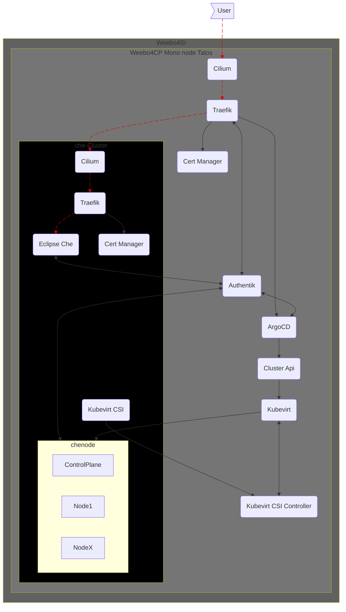

# Spoilers

```mermaid
flowchart TB
 subgraph chenode["chenode"]
        ControlPlane["ControlPlane"]
        Node1["Node1"]
        NodeX["NodeX"]
  end
 subgraph s1["che-Cluster"]
        che("Eclipse Che")
        kcsi("Kubevirt CSI")
        traefik2("Traefik")
        cilium2("Cilium")
        cm2("Cert Manager")
        chenode
  end
 subgraph subGraph1["Weebo4CP Mono node Talos"]
        kvirt("Kubevirt")
        capi("Cluster Api")
        auth("Authentik")
        traefik("Traefik")
        cilium("Cilium")
        kcsic("Kubevirt CSI Controller")
        cm1("Cert Manager")
        argo("ArgoCD")
        s1
  end
 subgraph Weebo4SI["Weebo4SI"]
        subGraph1
  end
    kcsi --> kcsic
    user>"User"] L_user_cilium_0@--> cilium
    cilium L_cilium_traefik_0@--> traefik
    traefik L_traefik_cilium2_0@--> cilium2 & cm1 & argo
    traefik <--> auth
    cilium2 L_cilium2_traefik2_0@--> traefik2
    traefik2 L_traefik2_che_0@--> che & cm2
    argo --> capi
    capi --> kvirt
    kvirt <--> kcsic
    auth L_auth_argo_0@<--> argo & chenode
    che <--> auth
    kvirt --> chenode

    style s1 fill:#000000
    style subGraph1 fill:#757575
    style Weebo4SI fill:#616161
    linkStyle 1 stroke:#D50000,fill:none
    linkStyle 2 stroke:#D50000,fill:none
    linkStyle 3 stroke:#D50000,fill:none
    linkStyle 7 stroke:#D50000,fill:none
    linkStyle 8 stroke:#D50000,fill:none

    L_user_cilium_0@{ animation: slow } 
    L_cilium_traefik_0@{ animation: slow } 
    L_traefik_cilium2_0@{ animation: slow } 
    L_cilium2_traefik2_0@{ animation: slow } 
    L_traefik2_che_0@{ animation: slow } 
    L_auth_argo_0@{ animation: none } 

```
