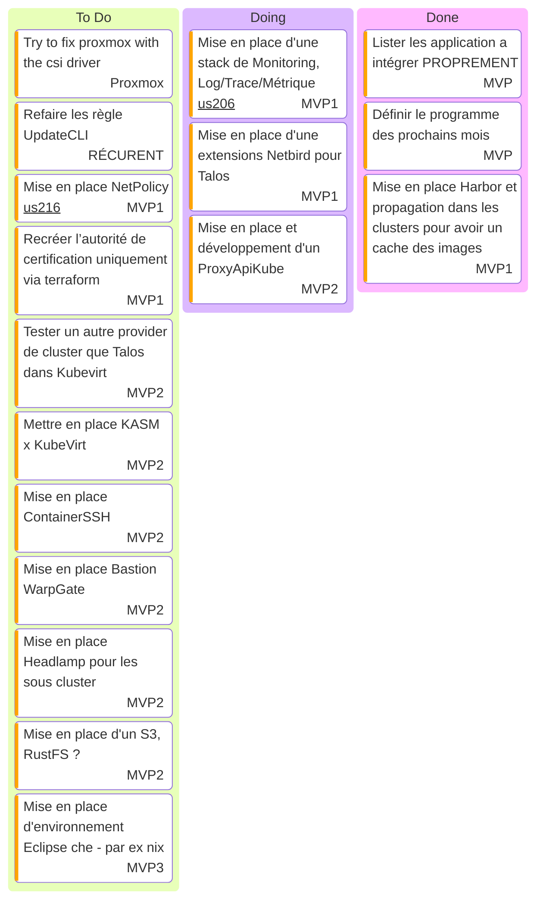

# Kanban

- [WarpGate](https://warpgate.null.page/docs/)
- [Grafana MCP](https://github.com/grafana/helm-charts/tree/main/charts/grafana-mcp)
- [Coroot Grafana Dashboards](https://github.com/kirillyu/coroot-grafana-dashboards)

## Bazar d'actions

- Tester l'Install de Talos via ISO ephemeral
- Travaux monitoring (voir us206)

## Actions récurrentes

- Vérifier les [MR](https://github.com/batleforc/weebo-si/pulls?q=is%3Aopen+is%3Apr+label%3AUpdateCLI) de mise a jour toute les semaines

## Stream

- [Playlist Twitch](https://www.twitch.tv/collections/Gha3LW0WLRh8hg)
- [Playlist YouTube](https://youtube.com/playlist?list=PLgGm8OmIPBhnlGhLG4RhUXV8zUvBmvl-O&si=dIglK5lVrDIImCQo)

### Stream 6 DECEMBRE 2025

- Debut : 16h30
- FIN : 18h57
- Vod : [Twitch](https://www.twitch.tv/batleforc) YouTube : Soon
- Musique: [NCS](https://ncs.io/)
- Objectif
  - ProxyAuthK8S
    - Développement de l'extensions Kubectl
  - Omarchy c'est sympa, mais c'étais sans doute trop tôt
- News
  - Dernier stream de 2025, Joyeuses fêtes a tous !
  - Stream orienté développement de notre extensions Kubectl
  - RDV en 2026 pour plus de péripéties !

### Stream 29 NOVEMBRE 2025

- Debut : 16h30
- FIN : ~ 18h45
- Vod : [Twitch](https://www.twitch.tv/batleforc) YouTube : Soon
- Musique: [NCS](https://ncs.io/)
- Objectif
  - ProxyAuthK8S : Du SSO PARTOUT !
    - Valider le token SSO provenant de kubectl
  - Kamalos : Et si on ajoutait un noeud Talos via VPN ?
- SideQuest
  - [Kamaji x Talos](https://www.youtube.com/watch?v=nSGo_72LnmY)
  - [Talos CSR Signer](https://github.com/clastix/talos-csr-signer/blob/master/docs/sidecar-deployment.md)
- News : Update soon

### Stream 22 NOVEMBRE 2025

- Debut : 16h30
- FIN : 19H05
- Vod : [Twitch](https://www.twitch.tv/batleforc) YouTube : Soon
- Musique: [NCS](https://ncs.io/)
- Objectif
  - ProxyAuthK8S
    - Début d'UI
    - Faire la validation du token provenant de l'interface
    - Bilan:
      - Interconnection et validation du token provenant de l'interface : DONE
      - Préparation d'un model d'authentification réutilisable pour l'authentification via kubectl : DONE
- SideQuest
  - [Kamalos !](/0.projects/kamalos)
- News
  - [Eclipse Che 7.112.0](https://github.com/eclipse-che/che/releases/tag/7.112.0)
  - [PVMSS](https://github.com/julienhmmt/pvmss)
  - [Noyra by s17n](https://github.com/syrm/noyra)

### Stream 15 NOVEMBRE 2025

- Debut : 16h30
- FIN : 18h10
- Vod : [Twitch](https://www.twitch.tv/videos/2619146743) YouTube : Soon
- Musique: [NCS](https://ncs.io/)
- Objectif
  - Admission Controller Talos
  - ProxyAuthK8S
    - Initialisation du projet
    - Parler des specs
- SideQuest
  - [Kamaji x Talos](https://www.youtube.com/watch?v=nSGo_72LnmY)
  - [Talos CSR Signer](https://github.com/clastix/talos-csr-signer/blob/master/docs/sidecar-deployment.md)
- News
  - [Umami V3 !](https://github.com/umami-software/umami)
  - [Kanidm](https://github.com/kanidm/kanidm) and [Kaniop](https://github.com/pando85/kaniop)
  - [Termix (alternative a Termius)](https://github.com/Termix-SSH/Termix)
  - Game on Container
    - [QuakeJS Arena](https://github.com/JackBrenn/quakejs-rootless)
    - [Doom your cluster !](https://github.com/storax/kubedoom)

### Stream 11 OCTOBRE 2025

- Debut : 16h30
- FIN : ~ 19H04
- Vod :
  - Twitch
    - [1/3](https://www.twitch.tv/videos/2589032809)
    - [2/3](https://www.twitch.tv/videos/2589043372)
    - [3/3](https://www.twitch.tv/videos/2589146936)
  - YouTube : Soon
- Musique: [NCS](https://ncs.io/)
- Objectif
  - Retour Netbird x Talos
    - Mise en place de la configuration Isolated Network
  - UserNamespace ?
    - Nested podman/docker ?
    - Industrialisation du build des images Talos
  - Retour [ProxyAuthK8S](https://github.com/batleforc/ProxyAuthK8S)
    - Avancement
    - Stocker les cluster dans Redis pour aller plus vite
    - Comprendre pourquoi les event ne sont pas attacher au Trace
- Bilan
  - Netbird x Talos : Contrainte technique (Pré provisionning des groups impossible)
  - UserNamespace
    - Activation dans Talos : DONE
    - Nested Build : Next Time
  - [ProxyAuthK8S](/0.projects/reverse-api-kube-oidc-based.html) : Pas eu le temps mais avancement en OFF voir spec

### Stream 27 SEPTEMBRE 2025

- Debut : 16h30
- FIN : ~ 18h30
- Vod :
  - Twitch
    - [1/3](https://www.twitch.tv/videos/2577116098)
    - [2/3](https://www.twitch.tv/videos/2577151005)
    - [3/3](https://www.twitch.tv/videos/2577153148)
  - YouTube : Soon
- Musique: [NCS](https://ncs.io/)
- Objectif
  - Ajouter au Sous Cluster Talos l'extensions [Netbird](https://github.com/siderolabs/extensions/tree/main/network/netbird)
    - Build de l'image ?!
    - Stockage de l'iso dans un S3 (RustFS ?!)
  - Chargement des métriques Traefik ++ envoie des traces Traefik vers OTEL Collector
  - Déployer [kubevirt operator](https://github.com/seatgeek/buildkit-operator)
  - Ajout d'une auth Authentik dans Vault
  - Retour stream CuistOps x Kubevirt x Capi x Talos x Cilium
    - Réseau
      - Cilium x Tunneling x Plage CIDR invalide
      - [Netbird x Talos](https://github.com/siderolabs/extensions/tree/main/network/netbird) (Not Tailscale xD)
    - Stockage
      - [Longhorn x Talos](https://github.com/longhorn/longhorn/pull/11199)

### Stream 20 SEPTEMBRE 2025

- Debut : 16h30
- FIN : ~ 18h30
- Vod : [Twitch](https://www.twitch.tv/videos/2571232605) [YouTube](https://youtu.be/_7REED7ysOA)
- Musique: [NCS](https://ncs.io/)
- Objectif
  - KubeApiProxy ?!
    - Parler des spec
    - Initialiser le projet
  - Chargement des métriques Traefik ++ envoie des traces Traefik vers OTEL Collector
  - Préparation de l'auto scaling des clusters Talos pour [lundi 22 SEPTEMBRE 2025](https://www.twitch.tv/cuistops)
  - Déployer [kubevirt operator](https://github.com/seatgeek/buildkit-operator)
  - Ajout d'une auth Authentik dans Vault
- Bilan
  - KubeApiProxy ?! and only kubeApiProxy

### Stream 13 SEPTEMBRE 2025

- Debut : 16h30
- FIN : ~ 18h30
- Vod : [Twitch](https://www.twitch.tv/videos/2565416116) [YouTube](https://youtu.be/1aH1YR0tBY4)
- Musique: [NCS](https://ncs.io/)
- Objectif
  - Pas MERCI CuistOps, Du GitOps dans nos VM ?!
    - Discussions autour du contexte
    - Comment le mettre en place ?
    - Boot-C x Cloud Init ?
  - KubeApiProxy ?!
  - déploiement OTEL
  - Chargement des métriques Traefik ++ envoie des traces Traefik vers OTEL Collector

### Stream 6 SEPTEMBRE 2025

- Debut : 16h30
- FIN : ~ 19h30
- Vod : [Twitch](https://www.twitch.tv/videos/2559647271) [YouTube](https://youtu.be/njCye6LxTE0)
- Musique: [NCS](https://ncs.io/)
- Objectif
  - On attaque la mise en place de la stack de monitoring !
    - Grafana ++ sidecar load source && dashboard
    - déploiement OTEL
    - Chargement des métriques Traefik ++ envoie des traces Traefik vers OTEL Collector
- Bilan
  - KubeApiProxy ?! : Next Time
  - Upgrade ArgoCD : DONE
  - Mise en place Grafana x Coroot : DONE
  - Next Step: Créer des dashboards Grafana pour coroot : DONE

### [Bilan des streams de la saison 2](/0.introduction/stream/saison2/index.html) - In Progress

### [Bilan des streams de la saison 1](/0.introduction/stream/saison1/index.html) - Finalisé

## Music

- [Chillhop](https://app.chillhop.com/)<= Plus calme
- [NCS](https://ncs.io/) <= Plus rythmé et varié (Pas encore testé)
