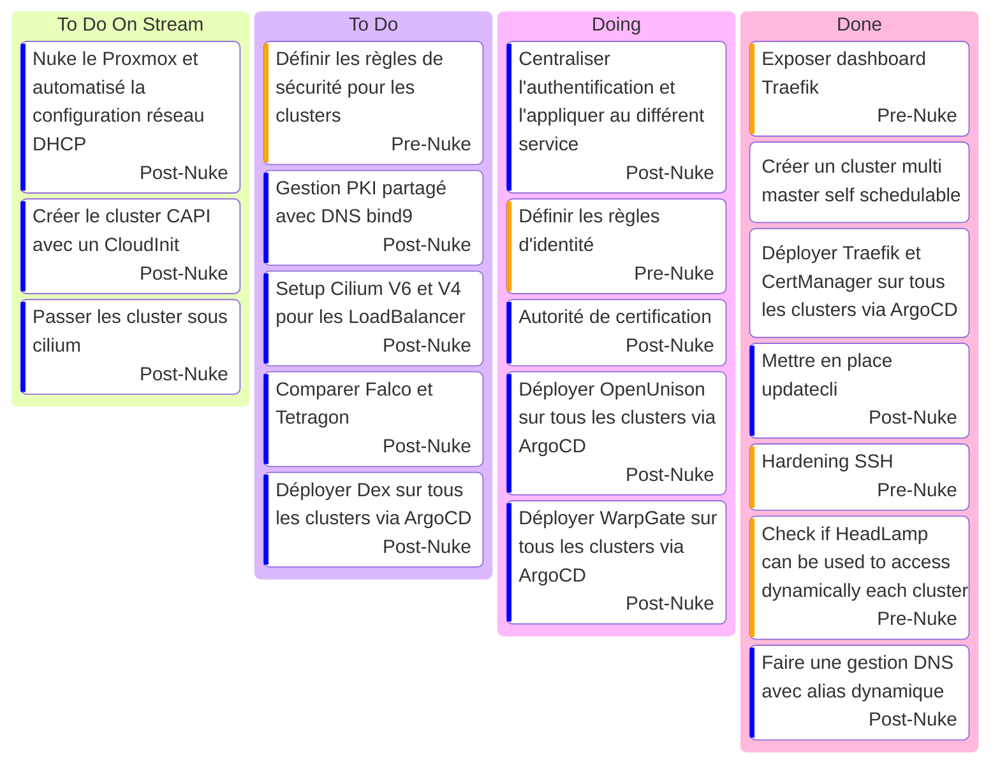

# Kanban

- [Talos Kubernetes configuration](https://www.talos.dev/v1.9/reference/configuration/v1alpha1/config/)
- [Terraform Cilium](https://registry.terraform.io/providers/littlejo/cilium/latest/docs/resources/cilium) plus jamais d'install manuelle !!!
- [Paralus](https://www.paralus.io/docs/Installation/) [ParalusTF](https://registry.terraform.io/providers/iherbllc/paralus/latest/docs)
- [OpenUnison](https://openunison.github.io/)
- [Falco rules](https://une-tasse-de.cafe/blog/falco/)
- [Dex](https://dexidp.io/)
- [WarpGate](https://warpgate.null.page/docs/)

## Stream

- [Playlist Twitch](https://www.twitch.tv/collections/Gha3LW0WLRh8hg)
- [Playlist YouTube](https://youtube.com/playlist?list=PLgGm8OmIPBhnlGhLG4RhUXV8zUvBmvl-O&si=dIglK5lVrDIImCQo)

### Stream 15 mars 2025

- Debut : 17h10
- FIN : ~19h00 - [Stream 2H41]
- Vod : [Twitch](https://www.twitch.tv/videos/2406435027) [YouTube](https://www.youtube.com/watch?v=fsg3unfvPKk)
- Musique: [Chillhop](https://app.chillhop.com/)Soon
- Objectif :
  - Présenté le projet
  - Terminer la configuration du cluster multi master self schedulable
  - Déployer Traefik et CertManager sur tous les clusters via ArgoCD
- Bilan
  - [Headlamp injection](https://headlamp.dev/docs/latest/inSoonstallation/in-cluster/#exposing-headlamp-with-an-ingress-server)
  - [Headlamp Oidc](https://headlamp.dev/docs/latest/installation/in-cluster/oidc/)
  - Task board mis a jour

### Stream 22 mars 2025

- Debut : 16h30
- FIN : ~ 18h30 - [Stream 2H23]
- Vod : [Twitch](https://www.twitch.tv/videos/2412410374) [YouTube](https://www.youtube.com/watch?v=KmYbE6V2qto)
- Musique: [NCS](https://ncs.io/) [Playlist](https://youtube.com/playlist?list=PLRBp0Fe2GpgnymQGm0yIxcdzkQsPKwnBD&si=sZjZvU09XJG6aqKQ)
- Objectif :
  - SOON TM
- Sujet Important
  - [Oh Hell No](https://developer-friendly.blog/blog/2025/03/17/migration-from-promtail-to-alloy-the-what-the-why-and-the-how/)
  - [Alloy](https://grafana.com/docs/alloy/latest/)
  - [Promtail deprecated](https://grafana.com/docs/loki/latest/send-data/promtail/)
  - Parler des sujets Special Stream et ceux que je me garde pour les longue nuit d'hiver
  - Incident Ovh 🤣
- Sujet secondaire
  - Passage a [Hyprland](https://hyprland.org/)
- Bilan
  - Beaucoup de lecture
    - Tester [OMNI](https://omni.siderolabs.com/tutorials/getting_started)
    - [Chaos Engineering](https://www.oreilly.com/library/view/chaos-engineering/9781492043850/)
    - [Argo Workflows](https://argo-workflows.readthedocs.io/en/latest/use-cases/ci-cd/)
    - [Argo Events](https://argoproj.github.io/argo-events/)
    - [OpenBao](https://github.com/openbao/openbao)
    - [OpenTofu](https://opentofu.org/)
  - Et un test de patch talosconfig sur le scheduling de noeud qui a mis en lumière un soucis de NodeRef
    - I0322 20:55:05.609493       1 scale.go:94] "one of machines does not have NodeRef" logger="controllers.TalosControlPlane" machine="mono-node-talos-cp-lvg4j"

### Stream 29 mars 2025

- Debut : 16h30
- FIN : ~ 18h50 - [Stream 2H21]
- Vod : [Twitch](https://www.twitch.tv/videos/2418536784) [YouTube](https://www.youtube.com/watch?v=VeUMq-RtwkM)
- Musique: [NCS](https://ncs.io/) [Playlist](https://www.youtube.com/watch?v=zyXmsVwZqX4&list=PLRBp0Fe2GpgleasyNsblE57aQt8xlEoVK)
- Objectif :
  - Tester le patch talosconfig en désactivant le scheduling sur les noeud master
  - Parler d'[Updatecli](https://www.updatecli.io/) et de la mise a jour des outils pendant le patch
  - Le reste est reporté
- Bilan
  - Vive le [Talos Cloud Controller Manager](https://github.com/ionos-cloud/cluster-api-provider-proxmox/discussions/405)
  - Patch du control plane fonctionnelle !!! (les 3 noeud ont été patché et renouvelé sans soucis)
  - Cluster API is back BABY

### Stream 5 avril 2025 - Pause (Out Of Town)

### Stream 12 avril 2025

- Debut : 16h30
- FIN : ~ 18h00 - [Stream 1h49]
- Vod : [Twitch](https://www.twitch.tv/videos/2430893763) [YouTube](https://youtu.be/VyTVqSORshM)
- Musique: [NCS](https://ncs.io/)
  - [NCS: Background Music 🎧 For Work, Study & Chill](https://www.youtube.com/playlist?list=PLRBp0Fe2GpgnRZpKULnyDQv9e_q41M6St)
- Objectif :
  - Tester [Falco](https://falco.org/blog/deploy-falco-talos-cluster/)
  - Parler du DNS automatisé :white_check_mark:
  - Parler de l'autorité de certification - Passage par OpenBao ou [BankVault](https://github.com/bank-vaults) ?
  - Nuke le proxmox - Reported again
- Sujet décisionnelle
  - Volonté d'utiliser les projets [CNCF](https://landscape.cncf.io/)
  - Choix Auth Provider
    - Model d'habilitation
      - RBAC
      - [ReBAC](https://www.permit.io/blog/relationship-based-access-control-rebac-with-open-policy-agent-opa)
    - Authority server
    - Should we use [OPA](https://www.openpolicyagent.org/) ?
  - Architecture
  - Gestion des secrets et des identités
- Bilan
  - Décision
    - Utilisation [OpenBao](https://openbao.org/) pour faire du RootCA / IntermediateCA ou [BankVault ?](https://github.com/bank-vaults)
    - [CertManager](https://cert-manager.io/docs/) pour faire le lien entre le cluster et l'autorité de certification
    - Utilisation de CertManager en DNS01 et HTTP01 possible
  - NUKE DU SERVEUR EN PREUMS LA PROCHAINE FOIS !!!!

### Stream 19 avril 2025

- Debut : 16h30
- FIN : ~ 19h27 - [Stream 2h57]
- Vod : [Twitch](https://www.twitch.tv/videos/2437118197) [YouTube](https://youtu.be/mQAp8V1QNPs) => Rendering en cours
- Musique: [NCS](https://ncs.io/)
  - [NCS: Background Music 🎧 For Work, Study & Chill](https://www.youtube.com/playlist?list=PLRBp0Fe2GpgnRZpKULnyDQv9e_q41M6St)
  - [NCS: The Best of 2025 ⚡️](https://www.youtube.com/playlist?list=PLRBp0Fe2GpgkDw2aMG2lM5heA8cbLvOoN)
- Objectif :
  - Nuke le proxmox :white_check_mark:
  - Automatiser la mise en place de l'autorité de certification RootCA / IntermediateCA via [Bank Vaults](https://bank-vaults.dev/). - Reported
  - Automatiser la création de certificats via le DNS01 et HTTP01 - Reported
  - Trust le RootCA sur mon ordinateur et le propager sur les clusters - Reported
- Sujet
  - Volonté d'utiliser les projets [CNCF](https://landscape.cncf.io/)
  - Besoin de pouvoir accéder aux clusters de manière sécurisé
    - [WarpGate](https://warpgate.null.page/docs/)
    - [ContainerSSH](https://containerssh.io/v0.5/)
    - [Pomerium](https://www.pomerium.com/docs/get-started/fundamentals/core/get-started)
    - [Eclipse Che](https://eclipse.dev/che/)
  - [Automated Security Test](https://www.securecodebox.io/)
- Bilan
  - Nuke du serveur fait avec un belle effet Demo :white_check_mark:
  - Création du cluster Capi et Main :white_check_mark:
  - Prévision d'un comparatif entre Flannel + MetalLB et Cilium la prochaine fois
  - Discussion autour du besoin d'accéder a l'environnement de manière sécurisé sans toujours passer par un VPN
  - Mise en place des [sync waves](https://argo-cd.readthedocs.io/en/stable/user-guide/sync-waves/) ArgoCD (Off Stream)

### Stream 26 avril 2025 - Pause (Out Of Town)

### Stream 3 mai 2025 : SOON TM

- Debut : 16h30
- FIN : ~ 18H30
- Vod : [Twitch](https://www.twitch.tv/batleforc) YouTube : SOON TM
- Musique: [NCS](https://ncs.io/)
  - [NCS: The Best of 2025 ⚡️](https://www.youtube.com/playlist?list=PLRBp0Fe2GpgkDw2aMG2lM5heA8cbLvOoN)
- Objectif :
  - Automatiser la mise en place de l'autorité de certification RootCA / IntermediateCA via [Bank Vaults](https://bank-vaults.dev/).
  - Automatiser la création de certificats via le DNS01 et HTTP01
  - Trust le RootCA sur mon ordinateur et le propager sur les clusters
  - Déployer un Auth Provider sur Main Cluster
- Sujet
- Bilan

## Music

- [Chillhop](https://app.chillhop.com/)<= Plus calme
- [NCS](https://ncs.io/) <= Plus rythmé et varié (Pas encore testé)

## Task

### us9 - Mettre en place updatecli

- [x] Créer un fichier de configuration updatecli
- [x] Mise en place CI/CD
- [x] Automatiser la mise a jour des outils dans le script ansible
- [ ] Automatiser la mise a jour des outils dans l'image Che-Ops
- [ ] Automatiser la mise a jour des Traefik
- [ ] Automatiser la mise a jour des CertManager
- [ ] Automatiser la mise a jour des Cilium
- [ ] Automatiser la mise a jour des Talos
- [ ] Automatiser la mise a jour des ArgoCD

### us15 - Faire une gestion DNS avec alias dynamique ✅

Solution possible ?

- [CoreDNS](https://coredns.io/) - Need ETCD ❌
- [RFC2136](https://github.com/kubernetes-sigs/external-dns/blob/master/docs/tutorials/rfc2136.md) - Need Bind9 ✔️

Mise en place d'un serveur DNS avec Bind9 et une automatisation via l'opérateur [External DNS](https://github.com/kubernetes-sigs/external-dns). En plus de l'opérateur External DNS, passage par les [CRD](https://github.com/kubernetes-sigs/external-dns/blob/master/docs/sources/crd.md) comme source.

- 1 Zone DNS weebo.
  - *.capi.weebo. => CAPI
  - *.main.weebo. => Main-Cluster
  - *.dev.weebo. => Dev-Cluster
  - *.test.weebo. => Test-Cluster
  - *.prod.weebo. => Prod-Cluster
- Record A / AAAA / NS / CNAME / TXT
- Forwarding du reste des requêtes en fonction de mon envie a l'instant T
  - <https://www.baeldung.com/linux/bind9-dns-server-configuration>

### us16 - Autorité de certification

Mise en place d'une autorité de Certification RootCA / IntermediateCA via [Bank Vaults](https://bank-vaults.dev/) et de son orchestrations.

Ne pas oublier une migration vers OpenBao quand celui-ci sera supporté par le projet.

- [Tuto HashiCorp](https://developer.hashicorp.com/vault/tutorials/pki/pki-engine)
- [Tuto OpenBao](https://openbao.org/docs/secrets/pki/quick-start-root-ca/)

L'objectif est que chaque Cluster puisse avoir son propre IntermediateCA et que l'autorité RootCA soit présente sur CAPI dans la déclinaison Vault présente.

Via la RFC2136, il sera possible de faire du DNS01 et a défaut du HTTP01 pour la création des certificats et sans oublier via [CertManager](https://cert-manager.io/docs/) pour la gestion des certificats.

Chaque cluster aura son propre sous-groupe de KV partageable.
