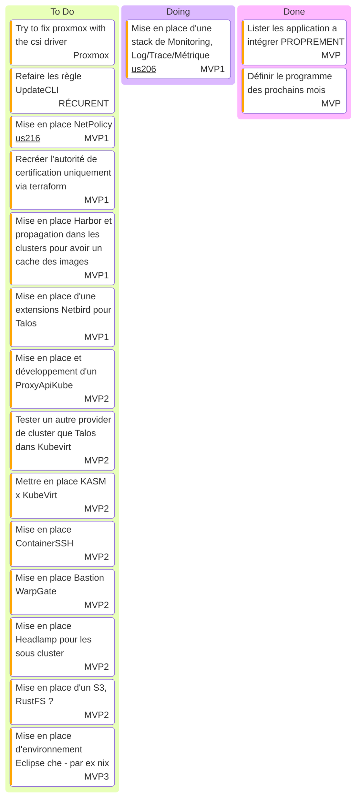

# Kanban

- [WarpGate](https://warpgate.null.page/docs/)
- [Grafana MCP](https://github.com/grafana/helm-charts/tree/main/charts/grafana-mcp)
- [Coroot Grafana Dashboards](https://github.com/kirillyu/coroot-grafana-dashboards)

## Actions récurrentes

- Vérifier les [MR](https://github.com/batleforc/weebo-si/pulls?q=is%3Aopen+is%3Apr+label%3AUpdateCLI) de mise a jour toute les semaines

## Stream

- [Playlist Twitch](https://www.twitch.tv/collections/Gha3LW0WLRh8hg)
- [Playlist YouTube](https://youtube.com/playlist?list=PLgGm8OmIPBhnlGhLG4RhUXV8zUvBmvl-O&si=dIglK5lVrDIImCQo)

### Stream 27 SEPTEMBRE 2025

- Debut : 16h30
- FIN : ~ 18h30
- Vod : [Twitch](https://www.twitch.tv/batleforc) YouTube : Soon
- Musique: [NCS](https://ncs.io/)
- Objectif
  - Chargement des métriques Traefik ++ envoie des traces Traefik vers OTEL Collector
  - Déployer [kubevirt operator](https://github.com/seatgeek/buildkit-operator)
  - Ajout d'une auth Authentik dans Vault

### Stream 20 SEPTEMBRE 2025

- Debut : 16h30
- FIN : ~ 18h30
- Vod : [Twitch](https://www.twitch.tv/videos/2571232605) YouTube : Soon
- Musique: [NCS](https://ncs.io/)
- Objectif
  - KubeApiProxy ?!
    - Parler des spec
    - Initialiser le projet
  - Chargement des métriques Traefik ++ envoie des traces Traefik vers OTEL Collector
  - Préparation de l'auto scaling des clusters Talos pour [lundi 22 SEPTEMBRE 2025](https://www.twitch.tv/cuistops)
  - Déployer [kubevirt operator](https://github.com/seatgeek/buildkit-operator)
  - Ajout d'une auth Authentik dans Vault
- Bilan
  - KubeApiProxy ?! and only kubeApiProxy

### Stream 13 SEPTEMBRE 2025

- Debut : 16h30
- FIN : ~ 18h30
- Vod : [Twitch](https://www.twitch.tv/videos/2565416116) [YouTube](https://youtu.be/1aH1YR0tBY4)
- Musique: [NCS](https://ncs.io/)
- Objectif
  - Pas MERCI CuistOps, Du GitOps dans nos VM ?!
    - Discussions autour du contexte
    - Comment le mettre en place ?
    - Boot-C x Cloud Init ?
  - KubeApiProxy ?!
  - déploiement OTEL
  - Chargement des métriques Traefik ++ envoie des traces Traefik vers OTEL Collector

### Stream 6 SEPTEMBRE 2025

- Debut : 16h30
- FIN : ~ 19h30
- Vod : [Twitch](https://www.twitch.tv/videos/2559647271) [YouTube](https://youtu.be/njCye6LxTE0)
- Musique: [NCS](https://ncs.io/)
- Objectif
  - On attaque la mise en place de la stack de monitoring !
    - Grafana ++ sidecar load source && dashboard
    - déploiement OTEL
    - Chargement des métriques Traefik ++ envoie des traces Traefik vers OTEL Collector
- Bilan
  - KubeApiProxy ?! : Next Time
  - Upgrade ArgoCD : DONE
  - Mise en place Grafana x Coroot : DONE
  - Next Step: Créer des dashboards Grafana pour coroot : DONE

### [Bilan des streams de la saison 2](/0.introduction/stream/saison2/index.html) - In Progress

### [Bilan des streams de la saison 1](/0.introduction/stream/saison1/index.html) - Finalisé

## Music

- [Chillhop](https://app.chillhop.com/)<= Plus calme
- [NCS](https://ncs.io/) <= Plus rythmé et varié (Pas encore testé)
