# Kanban

```mermaid
---
config:
  kanban:
    ticketBaseUrl: 'https://github.com/batleforc/weebo-si/issue/#TICKET#'
---

kanban
  todoS[To Do On Stream]
    us4[Nuke le Proxmox et automatisé la configuration réseau DHCP]@{ assigned: Post-Nuke, priority: 'Low'}
    us5[Créer le cluster CAPI avec un CloudInit]@{ assigned: Post-Nuke, priority: 'Low'}
    us6[Passer les cluster sous cilium]@{ assigned: Post-Nuke, priority: 'Low'}
  todo[To Do]
    us3[Définir les règles de sécurité pour les clusters]@{ assigned: Pre-Nuke, priority: 'High'}
    us7[Gestion PKI partagé avec DNS bind9]@{ assigned: Post-Nuke, priority: 'Low'}
    use10[Setup Cilium V6 et V4 pour les LoadBalancer]@{ assigned: Post-Nuke, priority: 'Low'}
    us11[Comparer Falco et Tetragon]@{ assigned: Post-Nuke, priority: 'Low'}
  doing[Doing]
    use12[Centraliser l'authentification0]@{ assigned: Post-Nuke, priority: 'Low'}
    us8[Définir les règles d'identité]@{ assigned: Pre-Nuke, priority: 'High'}
    use8[Check if HeadLamp can be used to access dynamically each cluster]@{ assigned: Pre-Nuke, priority: 'High'}
  done[Done]
    us7[Exposer dashboard Traefik]@{ assigned: Pre-Nuke, priority: 'High'}
    us1[Créer un cluster multi master self schedulable]
    us2[Déployer Traefik et CertManager sur tous les clusters via ArgoCD]
    us9[Mettre en place updatecli]@{ assigned: Post-Nuke, priority: 'Low'}
    us13[Hardening SSH]@{ assigned: Pre-Nuke, priority: 'High'}
```

- [Talos Kubernetes configuration](https://www.talos.dev/v1.9/reference/configuration/v1alpha1/config/)
- [Terraform Cilium](https://registry.terraform.io/providers/littlejo/cilium/latest/docs/resources/cilium) plus jamais d'install manuelle !!!
- [Paralus](https://www.paralus.io/docs/Installation/) [ParalusTF](https://registry.terraform.io/providers/iherbllc/paralus/latest/docs)
- [Falco rules](https://une-tasse-de.cafe/blog/falco/)
- [Dex](https://dexidp.io/)

## Stream

### Stream 15 mars 2025

- Debut : 17h10
- FIN : ~19h00
- Vod : [Twitch](https://www.twitch.tv/videos/2406435027) YouTube : Soon
- Musique: [Chillhop](https://app.chillhop.com/)Soon
- Objectif :
  - Présenté le projet
  - Terminer la configuration du cluster multi master self schedulable
  - Déployer Traefik et CertManager sur tous les clusters via ArgoCD
- Bilan
  - [Headlamp injection](https://headlamp.dev/docs/latest/inSoonstallation/in-cluster/#exposing-headlamp-with-an-ingress-server)
  - [Headlamp Oidc](https://headlamp.dev/docs/latest/installation/in-cluster/oidc/)
  - Task board mis a jour

### Stream 22 mars 2025

- Debut : 16h30
- FIN : ~ 18h30
- Vod : [Twitch](https://www.twitch.tv/videos/2412410374) YouTube : SOON TM
- Musique: [NCS](https://ncs.io/) [Playlist](https://youtube.com/playlist?list=PLRBp0Fe2GpgnymQGm0yIxcdzkQsPKwnBD&si=sZjZvU09XJG6aqKQ)
- Objectif :
  - SOON TM
- Sujet Important
  - [Oh Hell No](https://developer-friendly.blog/blog/2025/03/17/migration-from-promtail-to-alloy-the-what-the-why-and-the-how/)
  - [Alloy](https://grafana.com/docs/alloy/latest/)
  - [Promtail deprecated](https://grafana.com/docs/loki/latest/send-data/promtail/)
  - Parler des sujets Special Stream et ceux que je me garde pour les longue nuit d'hiver
  - Incident Ovh 🤣
- Sujet secondaire
  - Passage a [Hyprland](https://hyprland.org/)
- Bilan
  - Beaucoup de lecture
    - Tester [OMNI](https://omni.siderolabs.com/tutorials/getting_started)
    - [Chaos Engineering](https://www.oreilly.com/library/view/chaos-engineering/9781492043850/)
    - [Argo Workflows](https://argo-workflows.readthedocs.io/en/latest/use-cases/ci-cd/)
    - [Argo Events](https://argoproj.github.io/argo-events/)
    - [OpenBao](https://github.com/openbao/openbao)
    - [OpenTofu](https://opentofu.org/)
  - Et un test de patch talosconfig sur le scheduling de noeud qui a mis en lumière un soucis de NodeRef
    - I0322 20:55:05.609493       1 scale.go:94] "one of machines does not have NodeRef" logger="controllers.TalosControlPlane" machine="mono-node-talos-cp-lvg4j"

### Stream 29 mars 2025

- Debut : 16h30
- FIN : ~ 18h50
- Vod : [Twitch](https://www.twitch.tv/videos/2418536784) YouTube : SOON TM
- Musique: [NCS](https://ncs.io/) [Playlist](https://www.youtube.com/watch?v=zyXmsVwZqX4&list=PLRBp0Fe2GpgleasyNsblE57aQt8xlEoVK)
- Objectif :
  - Tester le patch talosconfig en désactivant le scheduling sur les noeud master
  - Parler d'[Updatecli](https://www.updatecli.io/) et de la mise a jour des outils pendant le patch
  - Le reste est reporté
- Bilan
  - Vive le [Talos Cloud Controller Manager](https://github.com/ionos-cloud/cluster-api-provider-proxmox/discussions/405)
  - Patch du control plane fonctionnelle !!! (les 3 noeud ont été patché et renouvelé sans soucis)
  - Cluster API is back BABY

### Stream 5 avril 2025 - Pause (Out Of Town)

### Stream 12 avril 2025 - Soon TM

- Debut : 16h30
- FIN : ~ 18h30
- Vod : Twitch YouTube : SOON TM
- Musique: [NCS](https://ncs.io/)
- Objectif :
  - Tester [Falco](https://falco.org/blog/deploy-falco-talos-cluster/)
  - Nuke le proxmox et recréer CAPI avec CloudInit / Ip Statique / Cilium !
  - Automatiser la configuration réseau
- Sujet décisionnelle
  - Volonté d'utiliser les projets [CNCF](https://landscape.cncf.io/)
  - Choix Auth Provider
    - Model d'habilitation
      - RBAC
      - [ReBAC](https://www.permit.io/blog/relationship-based-access-control-rebac-with-open-policy-agent-opa)
    - Authority server
    - Should we use [OPA](https://www.openpolicyagent.org/) ?
  - Architecture
  - Gestion des secrets et des identités
  - Rediffusion du stream
- Bilan
  - Soon TM

## Music

- [Chillhop](https://app.chillhop.com/)<= Plus calme
- [NCS](https://ncs.io/) <= Plus rythmé et varié (Pas encore testé)

## Task

### us9 - Mettre en place updatecli

- [x] Créer un fichier de configuration updatecli
- [x] Mise en place CI/CD
- [x] Automatiser la mise a jour des outils dans le script ansible
- [ ] Automatiser la mise a jour des outils dans l'image Che-Ops
- [ ] Automatiser la mise a jour des Traefik
- [ ] Automatiser la mise a jour des CertManager
- [ ] Automatiser la mise a jour des Cilium
- [ ] Automatiser la mise a jour des Talos
- [ ] Automatiser la mise a jour des ArgoCD
