# Kanban

```mermaid
---
config:
  kanban:
    ticketBaseUrl: 'https://github.com/batleforc/weebo-si/issue/#TICKET#'
---

kanban
  todo[To Do]
    us201[Lister les application a intégrer PROPREMENT]@{ assigned: MVP, priority: 'High'}
    us202[Définir le programme des prochains mois]@{ assigned: MVP, priority: 'High'}

  doing[Doing]
  done[Done]
```

- [WarpGate](https://warpgate.null.page/docs/)

## Actions récurrentes

- Vérifier les [MR](https://github.com/batleforc/weebo-si/pulls?q=is%3Aopen+is%3Apr+label%3AUpdateCLI) de mise a jour toute les semaines

## Stream

- [Playlist Twitch](https://www.twitch.tv/collections/Gha3LW0WLRh8hg)
- [Playlist YouTube](https://youtube.com/playlist?list=PLgGm8OmIPBhnlGhLG4RhUXV8zUvBmvl-O&si=dIglK5lVrDIImCQo)

### Stream 30 AOÛT 2025 - SAISON 2222222222

- Debut : 16h30
- FIN : ~ 18H30 - Petit stream I'm BACK !
- Vod : [Twitch](https://www.twitch.tv/batleforc) YouTube : Soon
- Musique: [NCS](https://ncs.io/)
- Objectif
  - Regarde le kanban 🤣
  - Psttt fin du MVP et début du suivant !!!

### [Bilan des streams de la saison 2](/0.introduction/stream/saison2/index.html) - In Progress

### [Bilan des streams de la saison 1](/0.introduction/stream/saison1/index.html) - Finalisé

## Music

- [Chillhop](https://app.chillhop.com/)<= Plus calme
- [NCS](https://ncs.io/) <= Plus rythmé et varié (Pas encore testé)
