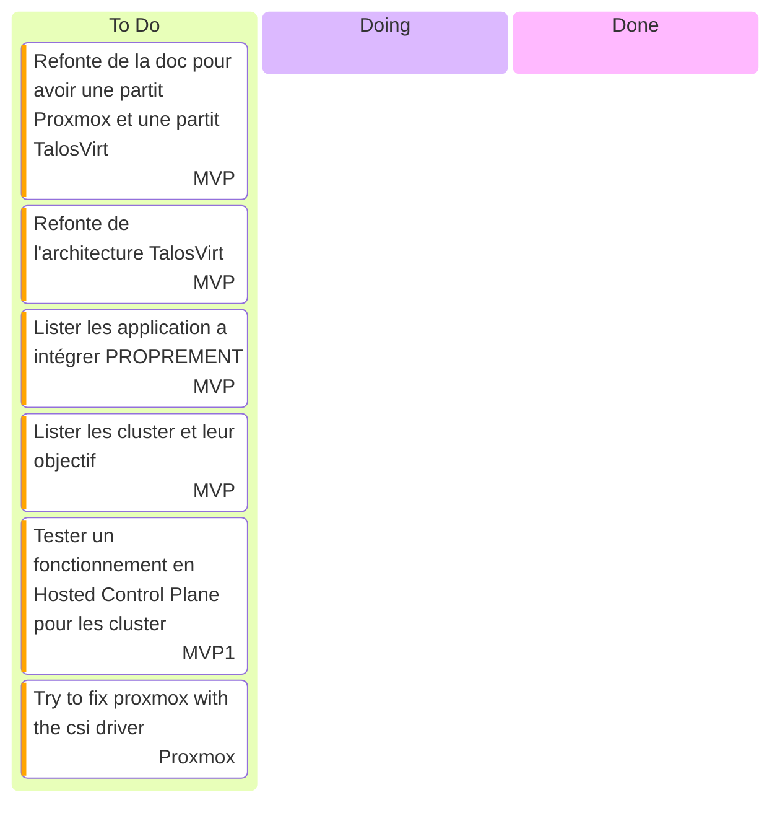

# Kanban

- [Talos Kubernetes configuration](https://www.talos.dev/v1.9/reference/configuration/v1alpha1/config/)
- [Terraform Cilium](https://registry.terraform.io/providers/littlejo/cilium/latest/docs/resources/cilium) plus jamais d'install manuelle !!!
- [Paralus](https://www.paralus.io/docs/Installation/) [ParalusTF](https://registry.terraform.io/providers/iherbllc/paralus/latest/docs)
- [OpenUnison](https://openunison.github.io/)
- [Falco rules](https://une-tasse-de.cafe/blog/falco/)
- [Dex](https://dexidp.io/)
- [WarpGate](https://warpgate.null.page/docs/)
- [Kyverno Reporter](https://kyverno.github.io/policy-reporter-docs/getting-started/installation.html)
- [Rook](https://rook.io/docs/rook/latest-release/Storage-Configuration/Object-Storage-RGW/object-storage/#create-local-object-stores-with-pool-placements)
- [Multi Auth](https://une-tasse-de.cafe/blog/apiserver-multi-idp/)
- [Proxmox CSI Driver](https://github.com/sergelogvinov/proxmox-csi-plugin)
- [Middleware block outside](https://doc.traefik.io/traefik/middlewares/http/ipwhitelist/)

## Actions récurrentes

- Nuke le Proxmox tout les 2 mois
  - last update : 19-04-2025
  - next update : 19-06-2025
- Vérifier les [MR](https://github.com/batleforc/weebo-si/pulls?q=is%3Aopen+is%3Apr+label%3AUpdateCLI) de mise a jour toute les semaines

## Stream

- [Playlist Twitch](https://www.twitch.tv/collections/Gha3LW0WLRh8hg)
- [Playlist YouTube](https://youtube.com/playlist?list=PLgGm8OmIPBhnlGhLG4RhUXV8zUvBmvl-O&si=dIglK5lVrDIImCQo)

### Stream XX XXXX XXXX - Vacance In Progress See you soon !

- Debut : 16h30
- FIN : ~ 18H30
- Vod : [Twitch](https://www.twitch.tv/batleforc) YouTube : Soon
- Musique: [NCS](https://ncs.io/)
- Objectif not Found ! The SI HAS BEEN CORRUPTED ?!

### Stream 28 Juin 2025

- Debut : 16h30
- FIN : 19H30
- Vod : [Twitch](https://www.twitch.tv/videos/2498250846) YouTube : Soon
- Musique: [NCS](https://ncs.io/)
- Objectif not Found ! The SI HAS BEEN CORRUPTED ?!
- Sujet
  - Pulumi Vs Terraform ?
  - Kubevirt !
- Bilan
  - Installation de l'infra en one commande via Pulumi
    - Talos
    - Cilium
    - ArgoCD
  - Passage de l'installe au format GitOps !

### Stream 21 juin 2025

- Debut : 16h30
- FIN : ~ 18H30
- Vod : [Twitch](https://www.twitch.tv/videos/2492048185) YouTube : Soon
- Musique: [NCS](https://ncs.io/)
- Objectif (Pas dans l'ordre):
  - Passer d'un cluster main avec les CP SelfSchedulable a non.
    - 1 CP (contre 3)
      - 4Gb Ram
      - 2 Cores
      - 10Gb de Stockages
    - x Worker (Gabarit différent ?)
      - 10Gb Ram
      - 4 Cores
      - 50Gb de Stockages
    - Si le nouveau model ne résous pas le problème... passage a [Omni](https://une-tasse-de.cafe/blog/omni/) qui le résoudra via le In-Place Upgrade
  - Explorer la mise en place de secrets
    - [Try ArgoCD Vault](https://argocd-vault-plugin.readthedocs.io/en/stable/installation/)
    - <https://external-secrets.io/latest/>
    - <https://developer.hashicorp.com/vault/docs/deploy/kubernetes/vso>
    - <https://bank-vaults.dev/docs/mutating-webhook/>
  - Configurer Authentik via une approche [GitOps](https://registry.terraform.io/providers/goauthentik/authentik/latest/docs)
- Sujet
  - [WasmEdge](https://github.com/siderolabs/extensions/tree/main/container-runtime/wasmedge)
  - [Pangolin](https://docs.fossorial.io/Pangolin/overview)
  - [NetBird](https://github.com/netbirdio/netbird)
  - [Proxmox hardening](https://raw.githubusercontent.com/community-scripts/ProxmoxVE/main/tools/pve/post-pve-install.sh)
  - [Node Problem Detector](https://github.com/kubernetes/node-problem-detector)
  - [Kargo](https://kargo.io/)
- Bilan
  - Nothing did go well !

### Stream 07 juin 2025 - Pause (Out Of Town)

### Stream 31 mai 2025

- Debut : 16h30
- FIN : 19h00
- Vod : [Twitch](https://www.twitch.tv/videos/2473394722) [YouTube](https://youtu.be/GGYvtPEl194)
- Musique: [NCS](https://ncs.io/)
- Objectif (Pas dans l'ordre):
  - Explorer la mise en place de secrets
    - [Try ArgoCD Vault](https://argocd-vault-plugin.readthedocs.io/en/stable/installation/)
    - <https://external-secrets.io/latest/>
    - <https://developer.hashicorp.com/vault/docs/deploy/kubernetes/vso>
    - <https://bank-vaults.dev/docs/mutating-webhook/>
  - Déployer un driver CSI ([Longhorn](https://www.talos.dev/v1.10/kubernetes-guides/configuration/storage/) ?) !
  - Configurer Authentik via une approche [GitOps](https://registry.terraform.io/providers/goauthentik/authentik/latest/docs)
    - [Bootstrap](https://docs.goauthentik.io/docs/install-config/automated-install)
    - [ArgoCD](https://docs.goauthentik.io/integrations/services/argocd/)
- Bilan
  - Beaucoup de questionnements sur la descente de l'authentification sur les différents clusters
  - Création d'un premier utilisateur, de deux groupes admin et user ainsi que l'application Argo pour Main-Cluster
  - Erreur lors de la suppression des mauvaises replicas au niveau de LongHorn

### Stream 24 mai 2025 - Out Of Town

### [Stream 17 mai 2025](/0.introduction/stream/17-05-2025.html)

### [Stream 10 mai 2025](/0.introduction/stream/10-05-2025.html)

### [Stream 3 mai 2025](/0.introduction/stream/03-05-2025.html)

### Stream 26 avril 2025 - Pause (Out Of Town)

### [Stream 19 avril 2025](/0.introduction/stream/19-04-2025.html)

### [Stream 12 avril 2025](/0.introduction/stream/12-04-2025.html)

### Stream 5 avril 2025 - Pause (Out Of Town)

### [Stream 29 mars 2025](/0.introduction/stream/29-03-2025.html)

### [Stream 22 mars 2025](/0.introduction/stream/22-03-2025.html)

### [Stream 15 mars 2025](/0.introduction/stream/15-03-2025.html)

## Music

- [Chillhop](https://app.chillhop.com/)<= Plus calme
- [NCS](https://ncs.io/) <= Plus rythmé et varié (Pas encore testé)

## Task

### us9 - Mettre en place updatecli

- [x] Créer un fichier de configuration updatecli
- [x] Mise en place CI/CD
- [x] Automatiser la mise a jour des outils dans le script ansible
- [x] Automatiser la mise a jour des outils dans l'image Che-Ops
- [x] Automatiser la mise a jour des Traefik
- [x] Automatiser la mise a jour des CertManager
- [x] Automatiser la mise a jour des Cilium
- [x] Automatiser la mise a jour des Talos
- [ ] Automatiser la mise a jour des ArgoCD

### us15 - Faire une gestion DNS avec alias dynamique ✅

Solution possible ?

- [CoreDNS](https://coredns.io/) - Need ETCD ❌
- [RFC2136](https://github.com/kubernetes-sigs/external-dns/blob/master/docs/tutorials/rfc2136.md) - Need Bind9 ✔️

Mise en place d'un serveur DNS avec Bind9 et une automatisation via l'opérateur [External DNS](https://github.com/kubernetes-sigs/external-dns). En plus de l'opérateur External DNS, passage par les [CRD](https://github.com/kubernetes-sigs/external-dns/blob/master/docs/sources/crd.md) comme source.

- 1 Zone DNS weebo.
  - *.capi.weebo.poc => CAPI
  - *.main.weebo.poc => Main-Cluster
  - *.dev.weebo.poc => Dev-Cluster
  - *.test.weebo.poc => Test-Cluster
  - *.prod.weebo.poc => Prod-Cluster
- Record A / AAAA / NS / CNAME / TXT
- Forwarding du reste des requêtes en fonction de mon envie a l'instant T
  - <https://www.baeldung.com/linux/bind9-dns-server-configuration>

### us16 - Autorité de certification ✅

Mise en place d'une autorité de Certification RootCA / IntermediateCA via [Bank Vaults](https://bank-vaults.dev/) et de son orchestrations.

Ne pas oublier une migration vers OpenBao quand celui-ci sera supporté par le projet.

- [Tuto HashiCorp](https://developer.hashicorp.com/vault/tutorials/pki/pki-engine)
- [Tuto OpenBao](https://openbao.org/docs/secrets/pki/quick-start-root-ca/)
- [A suivre](https://github.com/bank-vaults/bank-vaults/issues/3077)
- [Exemple](https://github.com/bank-vaults/bank-vaults/blob/main/vault-config.yml)
- [Google trust ?](https://serverfault.com/questions/946756/ssl-certificate-in-system-store-not-trusted-by-chrome) - Maybe ?

L'objectif est que chaque Cluster puisse avoir son propre IntermediateCA et que l'autorité RootCA soit présente sur CAPI dans la déclinaison Vault présente.

Via la RFC2136, il sera possible de faire du DNS01 et a défaut du HTTP01 pour la création des certificats et sans oublier via [CertManager](https://cert-manager.io/docs/) pour la gestion des certificats.

Chaque cluster aura son propre sous-groupe de KV partageable.

## usXX - Persistent Storage Cluster api Proof

- Longhorn
  - Nécessite de manuellement venir supprimer les replica avant la fin de refresh sinon perte de data
  - Dans un cas d'upgrade massive des noeud, trop long ?
- Rook
  - Test a venir
  - Installer les deux Helm Chart
    - <https://rook.github.io/docs/rook/v1.9/helm-operator.html>
    - <https://rook.github.io/docs/rook/v1.9/ceph-dashboard.html>
    - <https://rook.github.io/docs/rook/v1.9/ceph-cluster-crd.html#pvc-based-cluster>
    - <https://www.talos.dev/v1.10/kubernetes-guides/configuration/ceph-with-rook/>
