# Kanban

```mermaid
---
config:
  kanban:
    ticketBaseUrl: 'https://batleforc.github.io/weebo-si/0.us/#TICKET#'
---

kanban
  todo[To Do]
    us203[Try to fix proxmox with the csi driver]@{ assigned: Proxmox, priority: 'High'}
    us204[Refaire les règle UpdateCLI]@{ assigned: RÉCURENT, priority: 'High'}
    us216[Mise en place NetPolicy]@{ assigned: MVP1, priority: 'High', ticket: 'us216'}
    us205[Recréer l’autorité de certification uniquement via terraform]@{ assigned: MVP1, priority: 'High'}
    us207[Mise en place Harbor et propagation dans les clusters pour avoir un cache des images]@{ assigned: MVP1, priority: 'High'}
    us208[Mise en place d'une extensions Netbird pour Talos]@{ assigned: MVP1, priority: 'High'}
    us209[Mise en place et développement d'un ProxyApiKube]@{ assigned: MVP2, priority: 'High'}
    us210[Tester un autre provider de cluster que Talos dans Kubevirt]@{ assigned: MVP2, priority: 'High'}
    us211[Mettre en place KASM x KubeVirt]@{ assigned: MVP2, priority: 'High'}
    us212[Mise en place ContainerSSH]@{ assigned: MVP2, priority: 'High'}
    us213[Mise en place Bastion WarpGate]@{ assigned: MVP2, priority: 'High'}
    us214[Mise en place Headlamp pour les sous cluster]@{ assigned: MVP2, priority: 'High'}
    us215[Mise en place d'un S3, RustFS ?]@{ assigned: MVP2, priority: 'High'}
    us217[Mise en place d'environnement Eclipse che - par ex nix]@{ assigned: MVP3, priority: 'High'}
  doing[Doing]
    us206[Mise en place d'une stack de Monitoring, Log/Trace/Métrique]@{ assigned: MVP1, priority: 'High', ticket: 'us206'}
  done[Done]
    us201[Lister les application a intégrer PROPREMENT]@{ assigned: MVP, priority: 'High'}
    us202[Définir le programme des prochains mois]@{ assigned: MVP, priority: 'High'}
```

- [WarpGate](https://warpgate.null.page/docs/)
- [Grafana MCP](https://github.com/grafana/helm-charts/tree/main/charts/grafana-mcp)

## Actions récurrentes

- Vérifier les [MR](https://github.com/batleforc/weebo-si/pulls?q=is%3Aopen+is%3Apr+label%3AUpdateCLI) de mise a jour toute les semaines

## Stream

- [Playlist Twitch](https://www.twitch.tv/collections/Gha3LW0WLRh8hg)
- [Playlist YouTube](https://youtube.com/playlist?list=PLgGm8OmIPBhnlGhLG4RhUXV8zUvBmvl-O&si=dIglK5lVrDIImCQo)

### Stream 6 SEPTEMBRE 2025

- Debut : 16h30
- FIN : ~ 18h30
- Vod : [Twitch](https://www.twitch.tv/batleforc) YouTube : Soon
- Musique: [NCS](https://ncs.io/)
- Objectif
  - On attaque la mise en place de la stack de monitoring !
    - Grafana ++ sidecar load source && dashboard
    - déploiement OTEL
    - Chargement des métriques Traefik ++ envoie des traces Traefik vers OTEL Collector
- Bilan
  - KubeApiProxy ?! : Next Time
  - Upgrade ArgoCD : DONE

### Stream 30 AOÛT 2025 - SAISON 2222222222

- Debut : 16h30
- FIN : ~ 19H
- Vod : [Twitch](https://www.twitch.tv/videos/2553712231) YouTube : Soon
- Musique: [NCS](https://ncs.io/)
- Objectif
  - Regarde le kanban 🤣
  - Psttt fin du MVP et début du suivant !!!
- Bilan
  - Présentation des projet pour cette premiere partit de Saison 2
  - Exploration initial de Zot 👀
  - Début de l'exploration de la stack de monitoring

### [Bilan des streams de la saison 2](/0.introduction/stream/saison2/index.html) - In Progress

### [Bilan des streams de la saison 1](/0.introduction/stream/saison1/index.html) - Finalisé

## Music

- [Chillhop](https://app.chillhop.com/)<= Plus calme
- [NCS](https://ncs.io/) <= Plus rythmé et varié (Pas encore testé)
