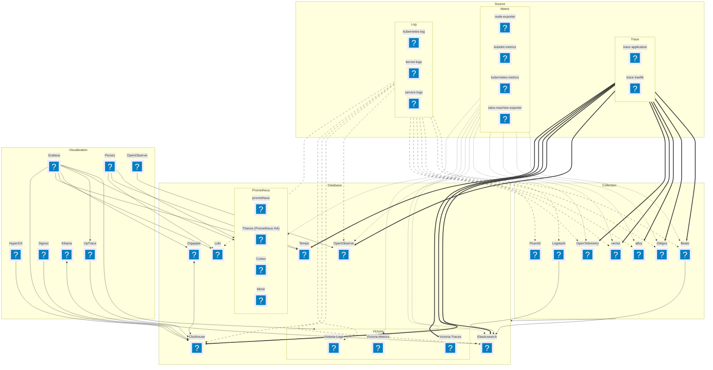

# Mise en place d'une stack de Monitoring (Log/Trace/Métrique)

## Besoins

- Collecte des métriques MainCluster / SubCluster
- Collecte des logs MainCluster / SubCluster
- Collecte des traces MainCluster / SubCluster
- Alerting
  - Santé des clusters
  - Santé des applications
- Reporting
  - Bilan de santé a la semaine auto
- Réactivité
  - Si app commence a trop consommer et flag comme non critique, scale a 0 (ou juste MR sur GitOps ?)
- GitOps && Automatisable
  - Injection des configurations via GitOps ou solution Gitopsifiable
  - Automatisation des déploiements et des mises à jour
  - Gestion des secrets et des configurations sensibles (Toute les briques doivent communiquer de manière sécurisée)

## Possibilités Techniques

- Prometheus = Stockage Metric > A Challenger
- Tempo = Stockage Trace > A Challenger
- Loki = Stockage Log > A Challenger
- Grafana = Visualisation > A Challenger

## Actions

- Collecte des métriques
  - Traefik
  - Harbor
  - Netbird ?
- Création de Dashboard Grafana
  - Traefik
  - Harbor
  - Netbird ?
- Création d'une source Clickhouse par cluster dans grafana
- Déployer un Otel Collector central puis un par cluster

## Source

- kubelet /metrics/resource
- <https://github.com/prometheus/node_exporter>
- <https://opentelemetry.io/docs/platforms/kubernetes/collector/components/>

## Collection Pipeline

- [Vector](https://vector.dev/)
- [Alloy](https://grafana.com/docs/alloy/latest/)
- [Odigos](https://odigos.io/) => eBPF trace collector/creator
- [Fluentd](https://www.fluentd.org/) => Log collector
- [Logstash](https://www.elastic.co/fr/logstash)
- [Beats](https://www.elastic.co/beats)
- [OpenTelemetry](https://opentelemetry.io/)

### Vector

- <https://www.talos.dev/v1.10/talos-guides/configuration/logging/#vector-example>

## Database

- [Gigapipe](https://github.com/metrico/gigapipe) => Basiquement Clickhouse mais en polyglot

### Metrics

- [Prometheus](https://prometheus.io/)
- [Clickhouse](https://clickhouse.com/)
- [VictoriaMetrics](https://victoriametrics.com/)
- [Gigapipe](https://github.com/metrico/gigapipe)
- [Thanos](https://thanos.io/)
- [Cortex](https://cortexmetrics.io/)
- [Mimir](https://grafana.com/oss/mimir/)
- [Elasticsearch](https://www.elastic.co/fr/elasticsearch/)
- [OpenObserve](https://openobserve.ai/)

### Traces

- [Tempo](https://grafana.com/oss/tempo/)
- [Clickhouse](https://clickhouse.com/)
- [VictoriaTraces](https://docs.victoriametrics.com/victorialogs/)
- [Gigapipe](https://github.com/metrico/gigapipe)
- [Elasticsearch](https://www.elastic.co/fr/elasticsearch/) => Nécessite l'APM et aucune info ne dis que l'endpoint otel est dispo en SelfHosted
- [OpenObserve](https://openobserve.ai/)

### Logs

- [Loki](https://grafana.com/oss/loki/)
- [Clickhouse](https://clickhouse.com/)
- [VictoriaLogs](https://docs.victoriametrics.com/victorialogs/)
- [Gigapipe](https://github.com/metrico/gigapipe)
- [Elasticsearch](https://www.elastic.co/fr/elasticsearch/)
- [OpenObserve](https://openobserve.ai/)

### Waiting

- <https://github.com/GreptimeTeam/greptimedb>

## Visualisation

- [Grafana](https://grafana.com/)
- [HyperDX](https://hyperdx.io/) -> Clickhouse only
- [Perses](https://github.com/perses/perses)
- [UpTrace](https://github.com/uptrace/uptrace)
- [Signoz](https://signoz.io/)
- [Kibana](https://www.elastic.co/fr/kibana)
- [OpenObserve](https://openobserve.ai/)

### Grafana

- <https://grafana.com/grafana/plugins/grafana-clickhouse-datasource/>

### Signoz

Signoz parait être assez cool. Si vous voulez plus d'info je vous invite a aller voir le stream de [TheRealSeboss666](https://www.twitch.tv/videos/2514289993).

#### CONTRE

- Zookeeper

#### Pour

Le produis semble vachement bien et super intelligent (Sauf que Zookeeper)

## Alerting

- [Alertmanager](https://prometheus.io/docs/alerting/latest/alertmanager/) -> Prometheus only
- [Karma](https://github.com/prymitive/karma) => Dashboard only

## All-in-one

- [coroot](https://docs.coroot.com/)

## Conclusion

### Status 30 Août 2025

Pas d'alerting dans le graph pour le moment, je n'ai pas encore de solutions qui me convienne

### Status 31 Août 2025

Sont retenues :

- Collection
  - Vector
  - OpenTelemetry
- Database
  - ClickHouse
- Visualization
  - Grafana
