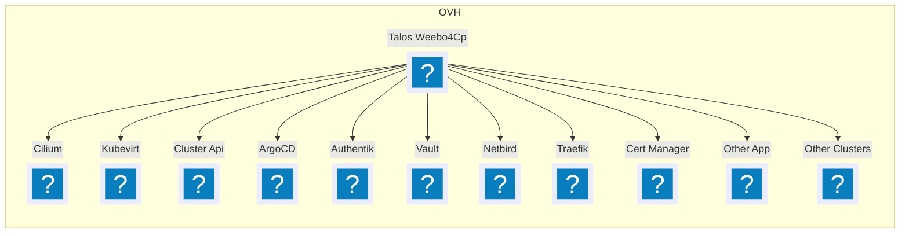
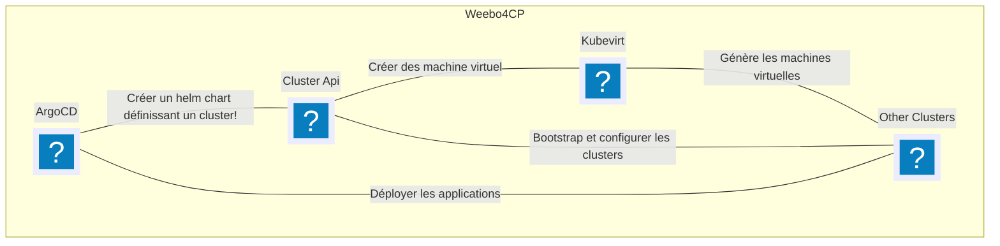

# Architecture de l'infra WeeboSI X Kubevirt

Dans cette architecture, **Talos** agit comme le point central, il orchestre les différentes applications et services déployés.

Celui-ci est augmenter avec plusieurs composants:

- [Cilium](https://cilium.io/), une solution de connectivité et de sécurité pour les conteneurs basée sur **eBPF**. Il prend la place de la gestion du réseau, il est un **CNI** (Container Network Interface) qui permet une communication sécurisée entre les pods.
- [Kubevirt](https://kubevirt.io/), une solution de virtualisation pour Kubernetes qui permet de gérer des machines virtuelles (VM) et des conteneurs de manière unifiée.
- [ArgoCD](https://argo-cd.readthedocs.io/en/stable/), outils GitOps permettant l'orchestration des déploiement Kubernetes.
- [Cluster API](https://cluster-api.sigs.k8s.io/), un projet qui fournit une API Kubernetes pour la gestion des clusters, facilitant la création, la mise à jour et la suppression de clusters Kubernetes.
- [Authentik](https://goauthentik.io/), une solution d'authentification et d'autorisation pour les applications modernes, prenant en charge divers protocoles d'authentification.
- [Vault](https://www.vaultproject.io/), un outil de gestion des secrets qui permet de stocker et de contrôler l'accès aux secrets de manière sécurisée.
- [Netbird](https://netbird.io/), une solution de réseau privé virtuel (VPN) qui permet de connecter des ressources de manière sécurisée.
- [Traefik](https://traefik.io/), un routeur de trafic moderne qui facilite la gestion des entrées et des sorties du trafic dans un cluster Kubernetes.
- [Cert Manager](https://cert-manager.io/), un outil qui automatise la gestion des certificats SSL/TLS dans Kubernetes.

Mais aussi des fonctionnalités avancées.

## Orchestration de Clusters Kubernetes

**ArgoCD** est utilisé pour orchestrer la création et la gestion de plusieurs clusters Kubernetes via **Cluster API** et **Kubevirt**. **ArgoCD** gère la configuration des clusters et déploie les applications nécessaires sur chaque cluster.

Les applications et configurations étant centralisées, celles-ci sont appliquées via un helm chart permettant un processus ***GitOps***. Ce processus garantit aussi une pérennisation de certaine industrialisation comme l'apport de bonnes pratiques ou fonctionnalités :

- Authentification auprès de Kubernetes via OpenID Connect et **Authentik**
- Gestion des secrets et délégation d'accès via **Vault**
- Mise en réseau sécurisée entre les pods via **Cilium**
- Expositions de certaines applications via **Traefik**
- Gestion des certificats SSL/TLS via **Cert Manager**
- Mise en place d'un DNS centralisé via **Bind9** et création d'entrées dynamiques via **ExternalDNS**
- Pérennisation du stockage via **KubeVirt CSI**
