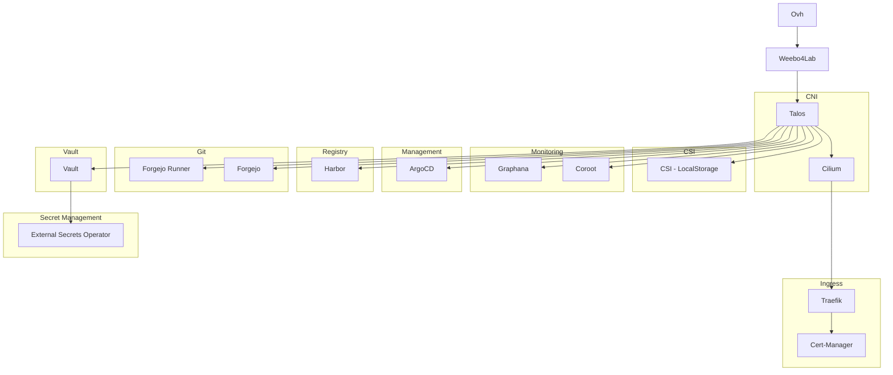

## Layer 0

### Talos

Talos sera installé sur un BM Ovh, la configuration de Talos est gérée via Pulumi.

Option a prendre en compte:

- UserNamespace
- Cilium
- CSR avec rotation automatique
- SeCompProfiles pour buildah si nécessaire
- OIDC Switch une fois déployer
- Extensions:
  - Iscsi-tools
  - utils-linux-tools
  - intel-ucode
  - mei
  - [youki](https://github.com/siderolabs/extensions/tree/main/container-runtime/youki)
  - [crun](https://github.com/siderolabs/extensions/tree/main/container-runtime/crun)
  - [wasmedge](https://github.com/siderolabs/extensions/tree/main/container-runtime/wasmedge)
  - Netbird ?
