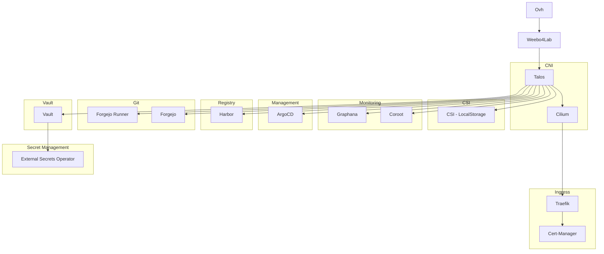

## Layer 0

```mermaid
graph TD
    A[Ovh] --> B[Weebo4Lab]
    B --> C[Talos]
    subgraph CNI
      C --> D[Cilium]
    end
    subgraph CSI
      C --> E[CSI - LocalStorage]
    end
    subgraph Ingress
      D ---> F[Traefik]
      F --> G[Cert-Manager]
    end
    subgraph Monitoring
      C --> H[Coroot]
      C --> I[Graphana]
    end
    subgraph Management
      C --> J[ArgoCD]
    end
    subgraph Registry
      C --> K[Harbor]
    end
    subgraph Git
      C --> L[Forgejo]
      C --> M[Forgejo Runner]
    end
    subgraph Vault
      C --> N[Vault]
    end
    subgraph Secret Management
      N --> O[External Secrets Operator]
    end
```