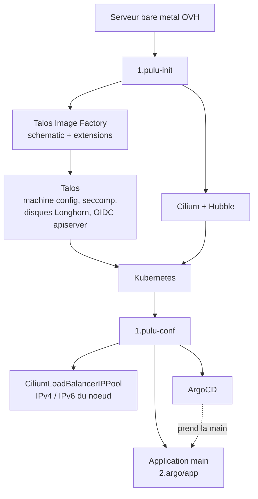
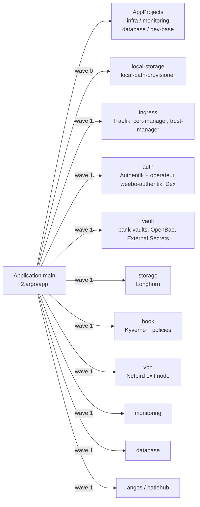

L'aspect "infrastructure" de Weebo est un ensemble de composants permettant de déployer et gérer les applications et services nécessaires au fonctionnement de Weebo.

Au niveau macro, l'infrastructure est composée de plusieurs composants :

- [Kubernetes](https://kubernetes.io/) (via [Talos](https://talos.dev/)) pour l'orchestration des conteneurs
- [Cilium](https://cilium.io/) pour la mise en réseau et la sécurité
- [Authentik](https://goauthentik.io/) pour l'authentification et [Dex](https://dexidp.io/) pour l'authentification pour certain sous composants
- [OpenBao](https://openbao.io/) pour le stockage des secrets et [BankVault](https://bankvaults.io/) pour la gestion d'OpenBao
- [ArgoCD](https://argo-cd.readthedocs.io/) pour la gestion des déploiements via l'approche GitOps
- [Cert-Manager](https://cert-manager.io/) pour la gestion des certificats et [Trust Manager](https://cert-manager.io/docs/trust/trust-manager/installation/) pour la propagation d'un bundle de confiance
- [Longhorn](https://longhorn.io/) pour le stockage persistant et [LocalStorage](https://github.com/rancher/local-path-provisioner) pour certains edge cases
- [ProxyAuthK8S](https://github.com/batleforc/ProxyAuthK8S) pour la gestion de l'authentification kube (WIP)

## Installation

Cette partie infra est déployée a la fois via Pulumi et ArgoCD, mais l'approche GitOps est privilégiée pour la gestion globale de ce projet.

Pulumi est utilisé pour orchestrer le déploiement et le provisionnement de l'infrastructure, cette partit couvre:

- Le déploiement de Talos sur les noeuds
- La configuration de Cilium pour la mise en réseau et la sécurité
- L'installation d'ArgoCD pour la gestion des déploiements via GitOps et la création de la premiére application ArgoCD `2.argo/app`

### Bootstrap Pulumi

Coté ArgoCD, l'application `2.argo/app` est responsable du déploiement de l'ensemble des composants de l'infrastructure, y compris Authentik, OpenBao, BankVault, Cert-Manager, Trust Manager, Longhorn et LocalStorage et bien plus.

### L'app of apps

`2.argo/app` ne contient que des `Application` et les `AppProject` qui les cadrent. Chaque application pointe vers un chart du dépôt et reste activable depuis `values.yaml`.

Les charts `ingress`, `auth`, `vault`, `hook` et `database` suivent tous le même découpage `main` / `sub` : `main` installe l'opérateur ou le chart amont, `sub` déclare les objets qui n'existent qu'une fois les CRD posées, dans une application synchronisée après.
