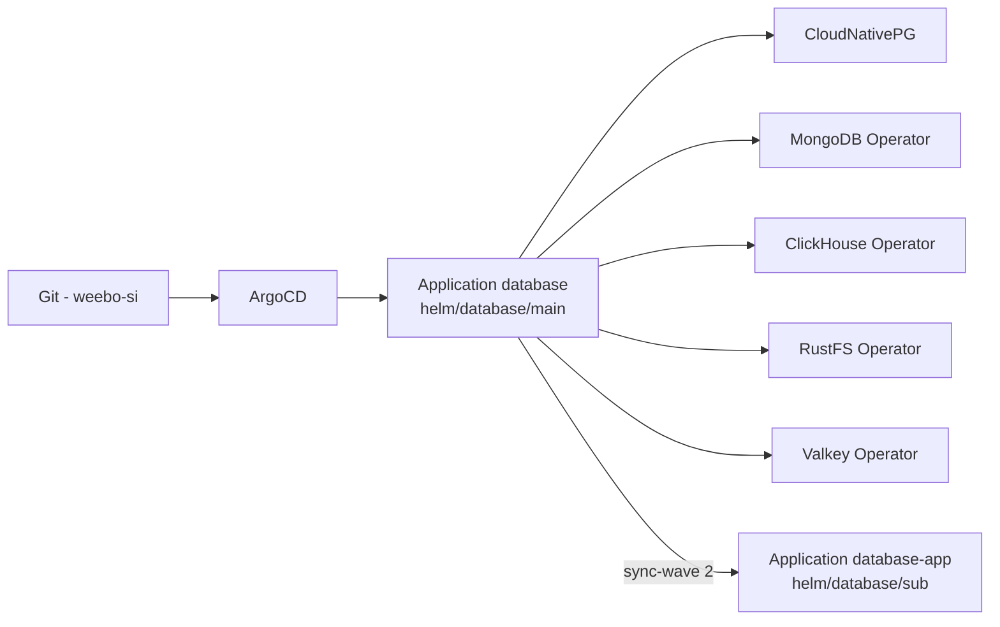
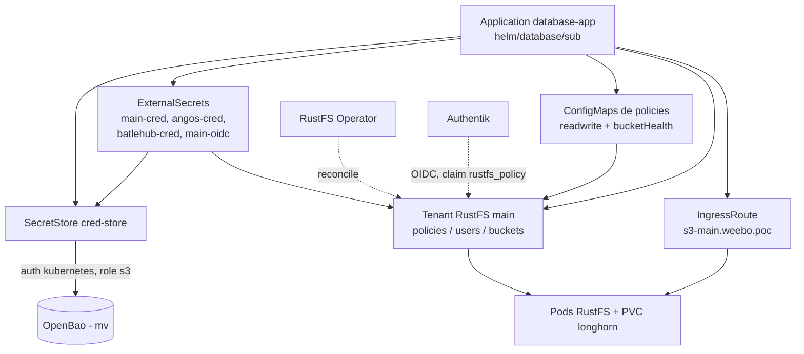
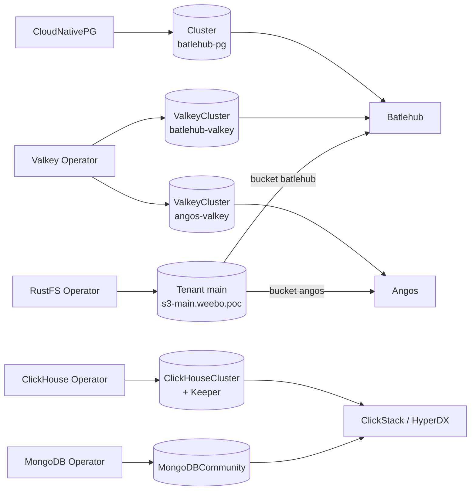

Pour la partit "base de données", le choix a été de passer par des opérateurs pour gérer les base de données.

Les stockage de données en place sont :

- [PostgreSQL](https://cloudnative-pg.io/) (CNPG)
- [MongoDB](https://github.com/mongodb/mongodb-kubernetes-operator) (MongoDB Operator)
- [ClickHouse](https://github.com/ClickHouse/ClickHouse) (ClickHouse Operator)
- [RustFS](https://github.com/rustfs/operator) (RustFS Operator)
- [Valkey](https://github.com/valkey-io/valkey) (Valkey Operator)

## Installation

Tout le fonctionnement de ce projet est basé sur l'utilisation d'ArgoCD, une application permet donc de regrouper toutes les applications relative a la db dans un seule dossier.

Cette application est trouvable dans `2.argo/helm/database` et est découper en deux parties:

- `main` : Contient tout le nécessaire pour déployer ces opérateurs et est controller via son `values.yaml` permettant de controller qu'elle opérateur est déployé ou non. Ce fichiers est aussi observé par renovate pour proposer des mises a jour des opérateurs.
- `sub` : Contient, quand nécessaires, le nécessaire a la configuration de chaque opérateur. Aujourd'hui (16-09-2026), seul rustfs nécessite une configuration particulière afin de provisionner un tennant S3 et synchroniser ces identifiant avec OpenBao.

### Déploiement des opérateurs

Chaque opérateur est activable / désactivable depuis `main/values.yaml` (`<operateur>.enabled`), et `subApp.enabled` conditionne a lui seul le déploiement de la partie `sub`.

### Configuration du tenant S3

La partie `sub` ne déploie aucun opérateur : elle écrit les objets que l'opérateur RustFS et External Secrets vont réconcilier.

## Qui consomme quoi

Les opérateurs ne portent aucune donnée : ce sont les applications qui déclarent leurs propres instances (CR) dans leur chart.

Les instances ClickHouse et MongoDB sont portées par le chart `2.helm/clickstack`, les instances Postgres / Valkey par les charts applicatifs (`2.argo/helm/batlehub`, `2.argo/helm/angos`), et le tenant S3 par `2.argo/helm/database/sub`.

## NTB

- !TODO : Au prochain reset de cluster, il faudra migrer Authentik vers la gestion CNPG/Valkey.
