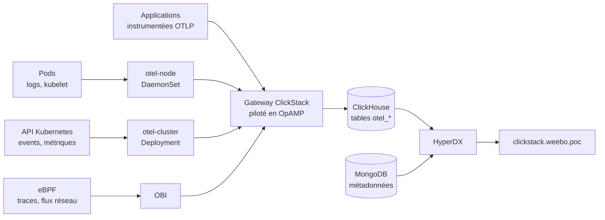
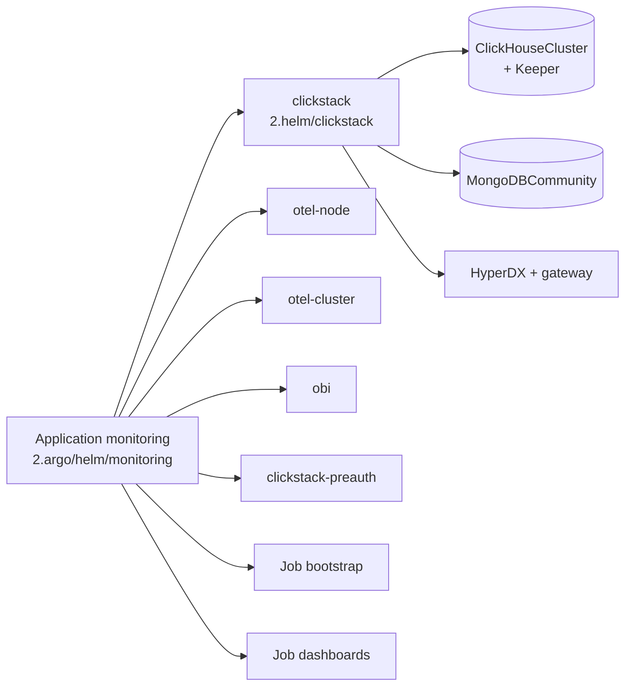
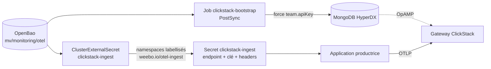

Pour la partie "monitoring", le choix et l'approche a mettre en place a changer... beaucoup trop de fois. Le choix final retenue a été de passer par `ClickStack` pour la partie centralisation.

La stack de monitoring est composée de plusieurs composants :

- [ClickStack](https://clickstack.io/) pour la centralisation des logs et métriques
- [OpenTelemetry](https://opentelemetry.io/) pour l'instrumentation des applications et services
- [Otel Collector](https://opentelemetry.io/docs/collector/) pour la collecte et l'exportation des données d'observabilité
- [OpenTelemetry eBPF Instrumentation](https://opentelemetry.io/docs/zero-code/obi/) pour l'instrumentation des applications et services au niveau du noyau

## Flux de télémétrie

Tout ce qui produit de la télémétrie passe par le même point d'entrée : la gateway livrée par ClickStack. Elle est pilotée en OpAMP par HyperDX, donc impossible à enrichir de receivers maison, d'où les collecteurs séparés qui lui parlent en OTLP.

## Installation

L'installation de la stack de monitoring est gérée via ArgoCD, avec une application dédiée `2.argo/helm/monitoring`. Cette application est découpée en plusieurs parties pour faciliter la gestion et la configuration des différents composants.

Cette installation profite de la gestion par opérateur de la partie [database](/docs/database) pour la partie ClickHouse et mongodb. Et pour l'aspect "configuration", un hook maisons a été mis en place pour appliquer la gestion des dashboards.

### Ce que déploie l'application

Le chart `2.helm/clickstack` est un fork du chart amont : les instances ClickHouse et MongoDB y sont déclarées en CR, et sont donc reconciliées par les opérateurs de la partie [database](/docs/database).

### La clé d'ingestion

ClickStack demande normalement deux gestes manuels : créer le premier compte, puis recopier la clé d'ingestion depuis Team Settings. Les deux sont supprimés, la clé de référence vivant dans OpenBao.

Brancher un nouveau producteur de télémétrie se résume donc à labelliser son namespace puis à faire un `envFrom` sur le Secret : pas d'écriture dans Vault, pas d'ExternalSecret par namespace, aucune valeur recopiée depuis l'UI.

Les dashboards suivent la même logique : le Job `clickstack-dashboards` rejoue `dashboards/*.json` contre l'API HyperDX, ne touche que ce qui porte le tag `managed-by-argocd`, et supprime ce qui a disparu du dépôt.

