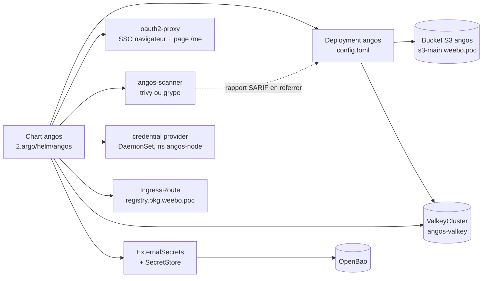
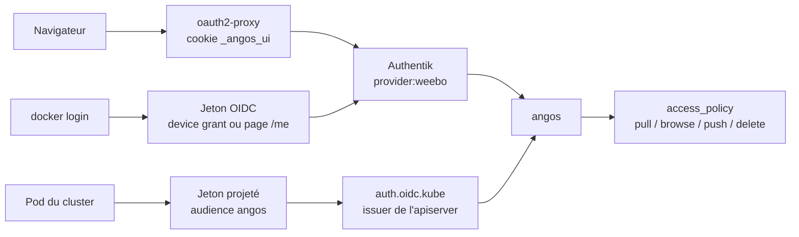

Angos sert les images docker et les charts helm du cluster, sur `registry.pkg.weebo.poc`. Il est déployé par le chart `2.argo/helm/angos`, dont le `values.yaml` décrit l'instance entière : dépôts, upstreams, politiques d'accès et scanner.

## Ce que déploie le chart

Le serveur lit deux fichiers : `config.toml`, rendu depuis `values.yaml`, où vivent les dépôts, leurs upstreams et leurs politiques d'accès ; et `secrets.toml`, monté depuis un ExternalSecret, où vivent les blocs qui portent un identifiant. Le stockage S3 et le Valkey sont dans le second, l'URL du Valkey étant écrite dans OpenBao par Terraform, mot de passe compris.

Le scanner est un second déploiement du même binaire qui repull l'image pour l'analyser, d'où son identité propre.

## Les trois chemins d'accès

Angos ne lit aucun cookie : c'est l'IngressRoute qui sépare les deux mondes, en ne passant par le proxy que ce qui porte la session ou n'est pas une route d'API. Côté cluster, un pod présente son propre jeton projeté et tire ses images sans `imagePullSecret`.
