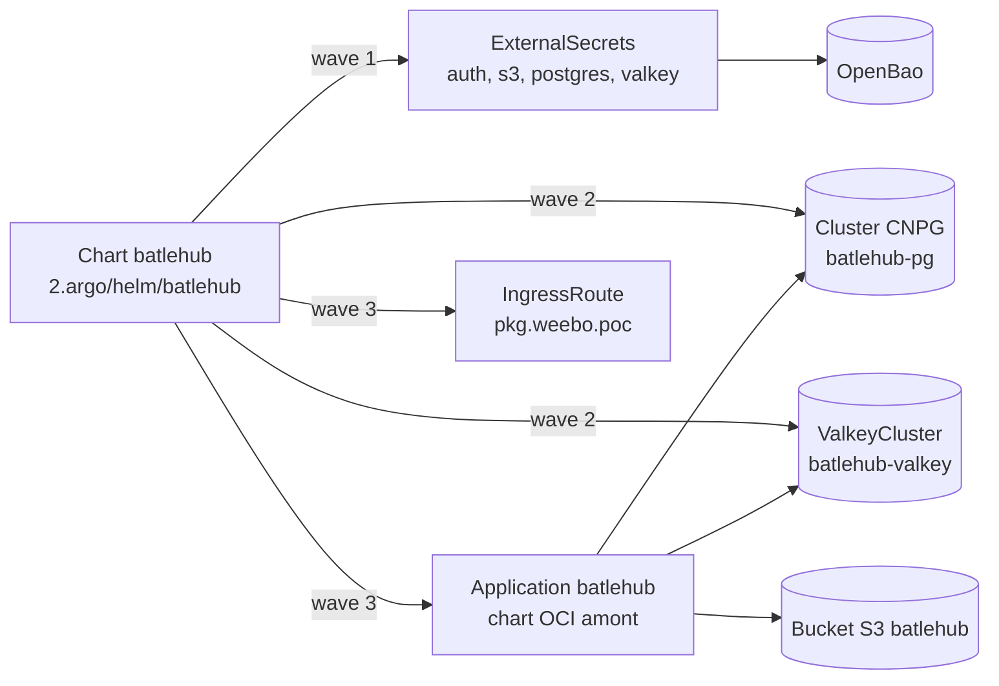
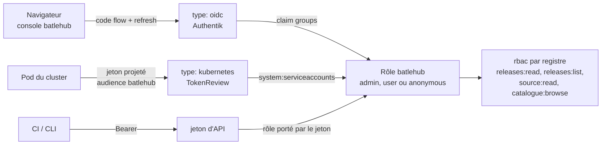
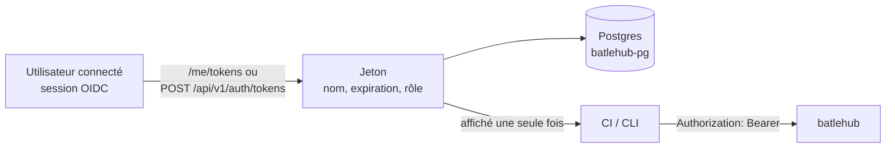

Batlehub sert les packages et leurs dépendances, sur `pkg.weebo.poc` et ses sous-domaines. Son déploiement attend la 1.3.0 pour être terminé.

## Ce que déploie le chart

Le chart local ne déploie pas batlehub lui-même : il prépare ses dépendances puis crée l'`Application` qui tire le chart amont, toute la configuration serveur étant passée en `valuesObject`. Les métadonnées vont en Postgres, les octets des artefacts dans le bucket S3.

## Les modes d'authentification

Le bloc `auth` de la configuration est une liste de fournisseurs, évalués dans l'ordre : le premier qui reconnaît la credential gagne, et une requête qui n'en porte aucune est traitée comme `anonymous`. Trois façons d'arriver authentifié, toutes sur le même en-tête `Authorization: Bearer` une fois la session obtenue.

- **OIDC** : le flow classique contre Authentik, avec `offline_access` pour que la SPA renouvelle sa session plutôt que de la voir expirer en pleine requête. Les rôles viennent du claim `groups`, mappé en dur : `weebo_admin` → `admin`, `weebo_moderator` → `user`.
- **Kubernetes** : un pod monte son propre jeton projeté avec l'audience `batlehub` et l'envoie tel quel ; le serveur le valide par TokenReview. Un jeton émis pour l'apiserver est refusé, l'audience est tout l'intérêt du contrôle. Aujourd'hui `system:serviceaccounts` est mappé sur `user`, donc n'importe quel pod du cluster lit les registres.
- **Jetons d'API** : c'est le mode qui reste à ouvrir. Deux variantes existent côté serveur — des jetons statiques déclarés en configuration (`type: token`, avec leur valeur, leur rôle et leur `user_id`), et des jetons générés par un utilisateur déjà connecté.

La seconde variante est la plus intéressante ici : elle ne demande aucune configuration dans le chart, l'utilisateur crée son jeton depuis la console une fois connecté en OIDC, et le rôle qu'il porte est choisi à la création. Le jeton vit en base, donc dans le Postgres du schéma plus haut, et n'est affiché qu'une fois.

Dans l'état actuel du chart, seuls `oidc` et `kubernetes` sont rendus dans la configuration : aucun bloc `type: token` n'est déclaré.

