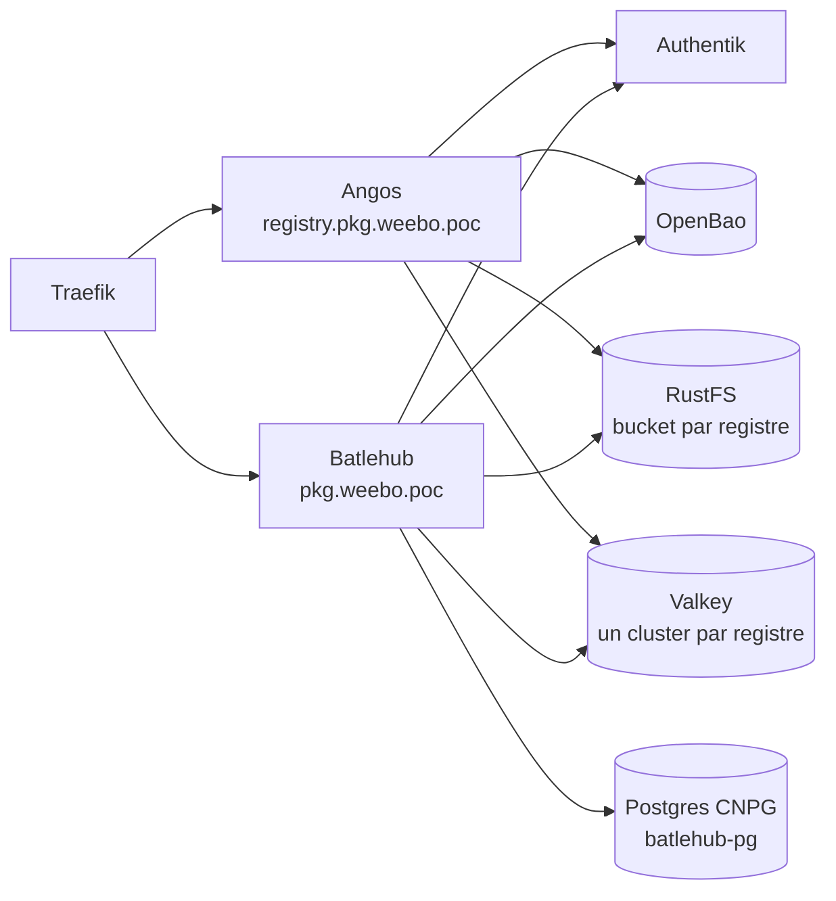

# Sujet en cours de mise en place, soyez indulgent

Pour la partie "registry", deux briques ont été choisies pour gérer les différents besoins :

- [Angos](https://github.com/angos/angos) pour la gestion des images docker et des chart helm
- [Batlehub](https://github.com/batlehub/batlehub) pour la gestion des packages et des dépendances - WIP nécessite la v1.3.0 pour finir sont déploiement

## Installation

Deux applications sont trouvables dans `2.argo/helm/angos` et `2.argo/helm/batlehub`. L'approche choisie est de rendre le `values.yaml` vraiment pilotant l'environnement.

Par exemple, pour Angos, le déploiement d'un nouveau repo est faisable comme suit :

```yaml
angos:
  repositories:
    hub:
      scan: false
      upstreams:
        - "https://registry-1.docker.io" # upstream docker hub
      access:
        pull: ["provider:weebo", "provider:kube"]
        browse: ["provider:weebo"]
    ghcr:
      scan: false
      upstreams:
        - "https://ghcr.io" # upstream github container registry
      access:
        pull: ["provider:weebo", "provider:kube"]
        browse: ["provider:weebo"]
    weebo:
      scan: true # scan des images activé par défaut
      access:
        pull: ["provider:weebo", "provider:kube"]
        browse: ["provider:weebo"]
        push: ["provider:weebo"]
        delete: ["group:weebo_admin"]
```

## Vue d'ensemble



Les deux registres reposent sur les mêmes briques : Authentik pour les identités, OpenBao pour les secrets, RustFS pour les octets et un Valkey par registre. Seul Batlehub ajoute un Postgres, où il range tout ce qui n'est pas un artefact.

Le détail de chacun vit sur sa propre page : [Angos](/docs/registry/angos) et [Batlehub](/docs/registry/batlehub).

