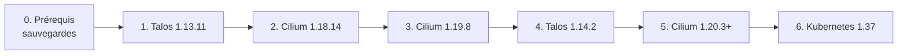

Le cluster tourne sur **un seul nœud** (`talos-r2k-rp0`, `37.187.255.5`), qui est à la fois control plane et worker. Chaque redémarrage de Talos ou de l'agent Cilium coupe donc tout le cluster, VM et workspaces compris. On monte une version à la fois et on vérifie entre chaque étape.

État de départ (octobre 2026) :

| Composant | Version | Où elle est fixée |
| --- | --- | --- |
| Talos | v1.13.5 | `1.pulu-init/Pulumi.dev.yaml` → `talosVersion` |
| Kubernetes | v1.36.2 | `1.pulu-init/Pulumi.dev.yaml` → `kubeVersion` |
| Cilium | v1.18.10 | `1.pulu-init/Pulumi.dev.yaml` → `ciliumVersion`, valeurs dans `1.pulu-init/cilium-values.yaml` |

## Ordre des étapes



Pourquoi cet ordre :

- **Une mineure à la fois**, toujours depuis le dernier patch de la mineure en cours : ni Talos ni Cilium ne testent les sauts de mineure ([Talos](https://docs.siderolabs.com/talos/v1.14/configure-your-talos-cluster/lifecycle-management/upgrading-talos), [Cilium](https://docs.cilium.io/en/v1.20/operations/upgrade/)).
- **Kubernetes en dernier** : Cilium 1.18 est testé jusqu'à Kubernetes 1.33 et Cilium 1.19 jusqu'à 1.35. Seul Cilium 1.20 couvre la 1.36 qu'on fait déjà tourner ([matrice](https://docs.cilium.io/en/v1.20/network/kubernetes/requirements/)). On ne monte pas Kubernetes avant d'être en Cilium 1.20.
- **Cilium 1.20.3 et pas 1.20.2** : la 1.20.2 a une régression où des endpoints perdent leurs règles de policy après un redémarrage de l'agent ([#49019](https://github.com/cilium/cilium/issues/49019)). Elle frapperait pendant la mise à jour elle-même, et les workspaces dépendent de ces policies.

## Les pièges propres à ce cluster

<Callout type="error" title="Ne jamais modifier talosInstallVersion">
`talosInstallVersion` alimente `dedicated.NewServerReinstallTask` dans `1.pulu-init/main.go`. Le changer peut **réinstaller le serveur OVH, donc effacer le disque**. Pour une mise à jour, on ne touche qu'à `talosVersion`.
</Callout>

<Callout type="warn" title="src_valid_mark doit rester à 0">
`net.ipv4.conf.all.src_valid_mark` est à `0` dans `1.pulu-init/main.go`. À `1`, toute résolution DNS IPv4 d'un pod soumis à une policy avec une règle DNS (tous les `toFQDNs`, donc networkProfiles et les workspaces) expire. C'est un bug Cilium encore ouvert dans toutes les versions ciblées ici ([#46284](https://github.com/cilium/cilium/issues/46284), [#46260](https://github.com/cilium/cilium/issues/46260), [#48706](https://github.com/cilium/cilium/issues/48706)). On le vérifie après **chaque** étape.
</Callout>

<Callout type="warn" title="Ne pas activer bpf.masquerade">
Avec le hostDNS de Talos (`forwardKubeDNSToHost`, actif par défaut), `bpf.masquerade: true` casse la résolution DNS externe de CoreDNS ([doc Sidero](https://docs.siderolabs.com/kubernetes-guides/cni/deploying-cilium)). Ça a été constaté sur ce cluster : github ne répondait plus, mais les noms internes oui. On reste en masquerading iptables.
</Callout>

Autres points à connaître :

- **Le provider `pulumi-cilium` n'est plus maintenu** (dernière version v0.2.1, juillet 2025, basée sur cilium-cli 1.18). Il télécharge le chart de la version demandée, mais sa logique n'a jamais été testée avec 1.19 ou 1.20, y compris l'étape séparée `NewHubble`. On compare donc toujours le rendu avec `helm template` avant d'appliquer.
- **Écart entre Pulumi et le nœud** : Pulumi déclare l'extension `siderolabs/fuse3`, mais le nœud ne l'a pas. La première mise à jour Talos faite depuis ce schematic l'ajoutera. Ça ne casse rien, mais c'est un changement à attendre.
- **Talos 1.14 et etcd 3.7** : une fois les données migrées en 3.7, revenir en Talos 1.13 n'est sûr qu'avec le snapshot pris avant.

## Avant de commencer

1. **Récupérer un `talosconfig`.** `task t` lit `0.config/talosconfig2.yaml`, absent d'un poste neuf. Vérifier l'accès :
   ```bash
   task t -- -n 37.187.255.5 version
   ```
2. **Récupérer un kubeconfig admin** dans `0.config/kubeconfig.yaml`, dont Pulumi a besoin (`KUBECONFIG` de la tâche `pulunit:base`). Le kubeconfig OIDC (`task k-o`) suffit pour les vérifications.
3. **Vérifier que `src_valid_mark=0` est bien appliqué par Pulumi**, et pas seulement en direct sur le nœud :
   ```bash
   task t -- -n 37.187.255.5 read /proc/sys/net/ipv4/conf/all/src_valid_mark   # doit afficher 0
   ```
   S'il affiche `1`, lancer d'abord `task pulunit:up` sur le commit qui le met à `0`.
4. **Sauvegardes**, à refaire avant chaque étape :
   ```bash
   mkdir -p .tmp/backup/$(date +%F)
   task t -- -n 37.187.255.5 etcd snapshot .tmp/backup/$(date +%F)/etcd.db
   task t -- -n 37.187.255.5 get mc -o yaml > .tmp/backup/$(date +%F)/machineconfig.yaml
   task pulunit:base -- stack export > .tmp/backup/$(date +%F)/pulumi-stack.json
   task k-o -- get cnp,ccnp,ciliumloadbalancerippools,ciliuml2announcementpolicies -A -o yaml > .tmp/backup/$(date +%F)/cilium-objects.yaml
   task k-o -- -n kube-system get cm cilium-config -o yaml > .tmp/backup/$(date +%F)/cilium-config.yaml
   ```
   Plus une sauvegarde Longhorn des volumes importants, depuis l'UI Longhorn.

## Vérifications après chaque étape

À lancer après chaque étape, avant de passer à la suivante. Si une ligne échoue, on s'arrête et on applique le retour arrière de l'étape.

```bash
# 1. Le nœud et le cluster
task t -- -n 37.187.255.5 health
task k-o -- get nodes -o wide
task k-o -- -n argocd get applications --no-headers -o custom-columns=N:.metadata.name,H:.status.health.status | grep -v Healthy

# 2. Cilium : état, mode de routage (Host: Legacy) et masquerading (IPTables)
CP=$(task k-o -- -n kube-system get pod -l k8s-app=cilium -o jsonpath='{.items[0].metadata.name}')
task k-o -- -n kube-system exec $CP -c cilium-agent -- cilium-dbg status --verbose | grep -E "^Cilium:|^Routing|^Masquerading|^KubeProxyReplacement"

# 3. src_valid_mark toujours à 0
task t -- -n 37.187.255.5 read /proc/sys/net/ipv4/conf/all/src_valid_mark

# 4. DNS sous policy depuis un workspace (IPv4 ET IPv6), puis flux autorisés et bloqués
P=$(task k-o -- -n dev-ws-batleforc get pod -l controller.devfile.io/devworkspace_id -o jsonpath='{.items[0].metadata.name}')
task k-o -- -n dev-ws-batleforc exec $P -c tools -- sh -c '
  getent ahostsv4 github.com | head -1
  for u in https://github.com https://cde.dev.weebo.poc http://che-host.eclipse-che.svc:8080/api/system/state https://kubernetes.default.svc/version; do
    curl -sk -o /dev/null -m 6 -w "%{http_code} $u\n" $u; done
  curl -sk -o /dev/null -m 6 -w "%{http_code} google (doit être bloqué: 000)\n" https://www.google.com'

# 5. Drops réseau inattendus
task k-o -- -n kube-system exec $CP -c cilium-agent -- hubble observe --verdict DROPPED --last 50
```

Penser aussi à vérifier :

- **le DNS des VM** ;
- **un pull d'image via angos**, par exemple en créant un nouveau workspace (images `registry.pkg.weebo.poc/quay/...`) ;
- **le login Che**, qui passe par dex puis Authentik.

## Étape 1 : Talos 1.13.5 → 1.13.11

Mise à jour patch : noyau 6.18.36 → 6.18.54, containerd 2.2.9, CoreDNS 1.14.7, etcd 3.6.14, et des corrections réseau qui concernent ce nœud (route IPv6, routes recréées en boucle, DHCP, nftables) ([notes de version](https://github.com/siderolabs/talos/releases/tag/v1.13.11)).

1. Sauvegardes (voir « Avant de commencer »).
2. Mettre à jour la version dans Pulumi, **uniquement `talosVersion`** :
   ```yaml
   # 1.pulu-init/Pulumi.dev.yaml
   0.pulumi:talosVersion: v1.13.11
   ```
3. Prévisualiser et lire le diff :
   ```bash
   task pulunit:base -- preview --diff
   ```
   On attend un nouveau schematic d'installation (et `fuse3`) et une config machine qui pointe vers le nouvel installer. **Si `reinstallTalos` apparaît dans le diff, on s'arrête.**
4. Appliquer, puis lancer la mise à jour du nœud avec l'image de l'installer :
   ```bash
   task pulunit:up
   task pulunit:base -- stack output schematicUpdateId
   task t -- -n 37.187.255.5 upgrade --image factory.talos.dev/installer/<schematicUpdateId>:v1.13.11
   ```
   Le nœud redémarre : le cluster est indisponible pendant quelques minutes.
5. Vérifications après chaque étape.

**Retour arrière** : `task t -- -n 37.187.255.5 rollback`, puis remettre `talosVersion: v1.13.5` dans Pulumi.

## Étape 2 : Cilium 1.18.10 → 1.18.14

Mise à jour patch. Aucune note ne touche au proxy DNS ni au routage legacy. Deux changements à surveiller :

- **Envoy passe en 1.37.**
- **L'option `enable-xt-socket-fallback` est enfin vraiment appliquée** ([#47635](https://github.com/cilium/cilium/pull/47635)). C'est sur le chemin iptables qu'emprunte le proxy DNS : bien vérifier le DNS sous policy après coup.

Le bug de la 1.18.8 où l'agent plantait au démarrage avec Talos, KPR et le proxy DNS transparent ([#45208](https://github.com/cilium/cilium/issues/45208)) a été fermé sans correctif. Il ne se produit pas en 1.18.10, mais c'est le premier suspect si l'agent ne démarre pas.

1. Sauvegardes.
2. Comparer le rendu du chart avec la config actuelle :
   ```bash
   helm repo add cilium https://helm.cilium.io && helm repo update
   helm template cilium cilium/cilium --version 1.18.14 -n kube-system -f 1.pulu-init/cilium-values.yaml > .tmp/cilium-1.18.14.yaml
   helm template cilium cilium/cilium --version 1.18.10 -n kube-system -f 1.pulu-init/cilium-values.yaml > .tmp/cilium-1.18.10.yaml
   diff .tmp/cilium-1.18.10.yaml .tmp/cilium-1.18.14.yaml | less
   ```
3. Mettre à jour la version, puis prévisualiser et appliquer :
   ```yaml
   # 1.pulu-init/Pulumi.dev.yaml
   0.pulumi:ciliumVersion: v1.18.14
   ```
   ```bash
   task pulunit:base -- preview --diff
   task pulunit:up
   ```
   L'agent redémarre : quelques secondes de coupure pour le DNS des pods sous policy, les VM et les connexions Envoy.
4. Vérifications après chaque étape, en insistant sur le point 4 (DNS sous policy).

**Retour arrière** : remettre `ciliumVersion: v1.18.10` puis `task pulunit:up`. Si Pulumi échoue, `helm rollback cilium -n kube-system`, puis remettre l'état Pulumi en cohérence.

## Étape 3 : Cilium 1.18.14 → 1.19.8

À lire avant : [notes de mise à jour 1.19](https://docs.cilium.io/en/v1.19/operations/upgrade/). Ce qui concerne ce cluster :

- Dans les motifs DNS, `**.` couvre maintenant plusieurs niveaux de sous-domaines. Nos profils utilisent `*.`, donc pas d'impact, mais à vérifier si quelqu'un a ajouté un `**.` entre-temps :
  ```bash
  task k-o -- get cnp,ccnp -A -o yaml | grep -n '\*\*\.'
  ```
- `CiliumLoadBalancerIPPool` en `v2alpha1` est déprécié. `1.pulu-conf` utilise déjà `cilium.io/v2`.
- `FromRequires` et `ToRequires` sont refusés dans les policies (non utilisés ici).
- Aucune valeur Helm de `cilium-values.yaml` n'est supprimée.

Procédure identique à l'étape 2 : sauvegardes, `helm template` pour comparer 1.18.14 et 1.19.8, `ciliumVersion: v1.19.8`, `preview --diff`, `pulunit:up`, puis les vérifications.

En plus des vérifications habituelles, vérifier que Hubble répond encore : l'étape `NewHubble` du provider Pulumi n'a jamais été testée avec 1.19.
```bash
task k-o -- -n kube-system get deploy hubble-relay hubble-ui
```

**Retour arrière** : `ciliumVersion: v1.18.14` puis `task pulunit:up`. On ne revient jamais en arrière de plus d'une mineure.

## Étape 4 : Talos 1.13.11 → 1.14.2

À lire avant : [notes de version 1.14.0](https://github.com/siderolabs/talos/releases/tag/v1.14.0). On vise **1.14.2**, qui corrige les routes recréées en boucle des 1.14.0 et 1.14.1 ([#14416](https://github.com/siderolabs/talos/issues/14416)).

Ce qui change pour ce cluster :

- **Format de config** : tous les champs utilisés ici sont dépréciés mais toujours supportés (`machine.sysctls`, `machine.files`, `machine.kubelet.extraArgs`/`extraMounts`, `cluster.apiServer`, `features.hostDNS`…). On **garde** le format v1alpha1. Le nouveau format multi-documents n'a plus `kubelet.extraMounts` ni les `extraVolumes` de l'apiserver, or on utilise les deux : `/var/local-path-provisioner` et `/var/lib/apiserver`, pour la config OIDC.
- **`talosVersion` est aussi passé à `GetConfigurationOutput`** (`main.go`). Si le provider Pulumi génère alors une config au format 1.14, c'est le diff du `preview` qui le montrera : **c'est le point à lire en priorité**.
- **etcd passe en 3.7** : métriques et santé sur le port 2383. Le retour en 1.13 n'est sûr qu'avec le snapshot.
- **TLS 1.3 minimum** pour kube-apiserver et etcd. Les clients anciens (scripts, outils) doivent le supporter.
- **`send_redirects=0`** par défaut, et NRI activé dans containerd.
- **L'isolation des workloads (sandboxd) reste désactivée** sur un cluster mis à jour. Ne pas l'activer : elle casse le plugin iSCSI dont Longhorn a besoin.
- Deux régressions des bêtas touchaient ce cluster, toutes deux corrigées en 1.14.0 : `authentication-config` cassé pour l'apiserver (#14030), et les règles ip6tables de Cilium en dual-stack (#13935).

1. Sauvegardes, **snapshot etcd obligatoire**.
2. `talosVersion: v1.14.2`, puis `task pulunit:base -- preview --diff`. Lire le diff de la config machine ligne par ligne. Si `extraMounts`, `extraVolumes` ou les `sysctls` disparaissent, on s'arrête.
3. `task pulunit:up`, puis `task t -- -n 37.187.255.5 upgrade --image factory.talos.dev/installer/<schematicUpdateId>:v1.14.2`.
4. Vérifications après chaque étape, plus :
   ```bash
   # l'apiserver accepte toujours les tokens OIDC (dex)
   task k-o -- auth whoami
   # les règles ip6tables de Cilium sont toujours en place
   task k-o -- -n kube-system exec $CP -c cilium-agent -- ip6tables -t mangle -S | grep -c TPROXY
   ```

**Retour arrière** : `task t -- -n 37.187.255.5 rollback`. Si le retour en 1.13 échoue à cause d'etcd, restaurer le snapshot (`talosctl bootstrap --recover-from=...`), puis remettre `talosVersion: v1.13.11` dans Pulumi.

## Étape 5 : Cilium 1.19.8 → 1.20.3 (ou plus)

**Pas avant que [#49019](https://github.com/cilium/cilium/issues/49019) soit corrigé** : vérifier dans les notes de version de la 1.20.x visée.

À lire avant : [notes de mise à jour 1.20](https://docs.cilium.io/en/v1.20/operations/upgrade/). Ce qui concerne ce cluster :

- **Accès des pods aux services NodePort** : avec `socketLB.hostNamespaceOnly`, ils sont maintenant load-balancés côté pod client. Les policies doivent alors autoriser l'egress vers les backends, et les backends l'ingress depuis le client.
- **Les CNP vides sont refusées** (validation CEL). Vérifier que l'opérateur weebo-si-hardening n'en écrit jamais :
  ```bash
  task k-o -- get cnp -A -o json | python3 -c 'import json,sys; [print(i["metadata"]["namespace"], i["metadata"]["name"]) for i in json.load(sys.stdin)["items"] if not (i["spec"].get("ingress") or i["spec"].get("egress") or i["spec"].get("ingressDeny") or i["spec"].get("egressDeny"))]'
  ```
- `CiliumNodeConfig` en `v2alpha1` est supprimé (non utilisé ici). `CiliumL2AnnouncementPolicy` n'existe encore qu'en `v2alpha1`, sans conséquence tant que les annonces L2 ne sont pas activées.
- **BTF** : vérifier que le noyau l'expose, sinon le socket-LB ne se charge pas ([#48778](https://github.com/cilium/cilium/issues/48778)) :
  ```bash
  task t -- -n 37.187.255.5 ls /sys/kernel/btf/vmlinux
  ```

Procédure identique à l'étape 3 : `helm template` pour comparer, `ciliumVersion`, `preview --diff`, `pulunit:up`, vérifications.

**Retour arrière** : `ciliumVersion: v1.19.8` puis `task pulunit:up`.

## Étape 6 : Kubernetes 1.36 → 1.37

Seulement une fois Talos en 1.14.x (qui supporte Kubernetes 1.33 à 1.37) et Cilium en 1.20.x.

1. Sauvegardes, snapshot etcd.
2. Lancer la mise à jour, puis aligner Pulumi :
   ```bash
   task t -- -n 37.187.255.5 upgrade-k8s --to 1.37.1
   ```
   ```yaml
   # 1.pulu-init/Pulumi.dev.yaml
   0.pulumi:kubeVersion: v1.37.1
   ```
3. Vérifications après chaque étape, plus le login OIDC (`task k-o -- auth whoami`).

**Retour arrière** : Kubernetes ne se rétrograde pas proprement. C'est le snapshot etcd de l'étape 1 qui sert de filet de sécurité.

## Sources

- Talos : [v1.13.11](https://github.com/siderolabs/talos/releases/tag/v1.13.11), [v1.14.0](https://github.com/siderolabs/talos/releases/tag/v1.14.0), [mise à jour de Talos](https://docs.siderolabs.com/talos/v1.14/configure-your-talos-cluster/lifecycle-management/upgrading-talos), [matrice de support](https://docs.siderolabs.com/talos/v1.14/getting-started/support-matrix), [Cilium sur Talos](https://docs.siderolabs.com/kubernetes-guides/cni/deploying-cilium)
- Cilium : [v1.18.14](https://github.com/cilium/cilium/releases/tag/v1.18.14), [mise à jour 1.19](https://docs.cilium.io/en/v1.19/operations/upgrade/), [mise à jour 1.20](https://docs.cilium.io/en/v1.20/operations/upgrade/), [prérequis Kubernetes](https://docs.cilium.io/en/v1.20/network/kubernetes/requirements/)
- Bug DNS et `src_valid_mark` : [#46284](https://github.com/cilium/cilium/issues/46284), [#46260](https://github.com/cilium/cilium/issues/46260), [#48706](https://github.com/cilium/cilium/issues/48706), [#48928](https://github.com/cilium/cilium/pull/48928)
