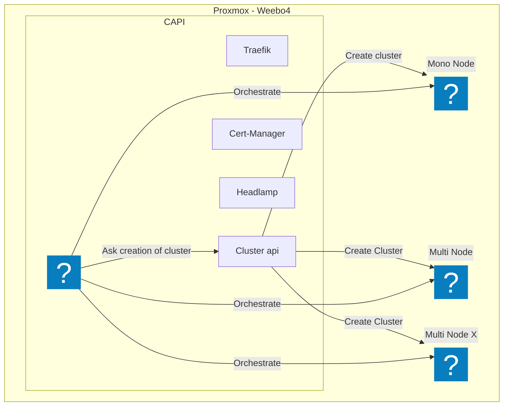

# Architecture des noeud et répartition des services

Dans cette architecture, on dois pouvoir avoir plusieurs noeud Proxmox. Notre base est le noeud Weebo4 mais nos applicatif pourrons et devrons être réparti sur plusieurs noeud. Pour le représenté, on ajouter le noeud WeeboX.

Chaque actions sur l'environnement devra être reproductible et automatisé. Pour cela, on utilise la logique GitOps et des jobs/CronJobs pour automatiser les taches via du Terraform ou de l'Ansible.

## Cluster CAPI - Single Point Of Failure

Le cluster CAPI est le cluster qui va gérer les autres clusters. Il est pour le moment en mono-node mais devrais passer en multi-node avec l'ajout d'un noeud Proxmox.

Celui-ci est voué a gérer les autres clusters. Et ce via l'API de Kubernetes.

Les seules applications qui tournerons sur ce cluster sont:

- [ArgoCD](https://argoproj.github.io/argo-cd/)
- [Traefik](https://doc.traefik.io/traefik/) => Reverse Proxy pour HeadLamp et ArgoCD
- [Cert-Manager](https://cert-manager.io/docs/) => Gestion des certificats
- [Headlamp](https://headlamp.dev/) => Interface de gestion de Kubernetes

## Les clusters enfants

Chaque cluster enfant de la CAPI devra être provisionné par le cluster CAPI et porté une authentification OIDC. Cette authentification sera géré par Zitadel et disponible une fois que le premier cluster sera provisionné. (Nécessite un double déploiement du premier cluster)

En plus de l'authentification, chaque cluster enfant devra avoir les applications suivantes:

- [Traefik](https://doc.traefik.io/traefik/) => Reverse Proxy pour les applications
- [Cert-Manager](https://cert-manager.io/docs/) => Gestion des certificats
- [Prometheus Stack](https://prometheus.io/docs/introduction/overview/) => Monitoring des applications
  - Prometheus pour la collecte des métriques et l'envoie vers le serveur central
  - Promtail pour la collecte des logs et l'envoie vers le serveur Loki central
  - Otel Operator pour la collecte des traces et l'envoie vers le serveur Tempo central
- [Falco](https://falco.org/docs/) => Détection d'anomalie qui seront envoyé a Talon mais aussi a un Tempo centralisé
- [Talon](https://github.com/falcosecurity/falco-talon) => Réponse aux anomalies
- Une solution de backup pour les parties nécessaires ou les données seront envoyé vers un bucket S3

## Main Multi-Node Talos

Ce cluster principal va porter la charge de travail centrale. Il est le cluster principal pour les applications mais n'est pas dédié a des applications dites "sensibles". Il est le cluster principal pour les application centrales.

## Child Multi-Node Talos

Ces clusters sont les clusters enfants du cluster principal. Ils sont dédié a des applications sensibles ou métier et ne sont pas accessible directement depuis l'extérieur. Ils sont accessible via le cluster principal ou via un VPN.

