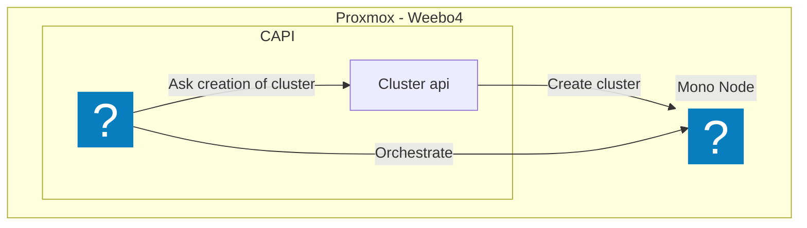

# Etape

## 1. Création de l'infrastructure

Mes connaissances en Talos/Proxmox/CAPI sont nulls, donc on est sur du Zero to Hero (ou du moins j'espère).

```mermaid
architecture-beta
    group lab(mdi:cloud)[Weebo_lab]

    service proxmox(mdi:cloud)[Proxmox] in lab
    service weebo4(mdi:server)[Weebo4] in lab
    service weebo4_local(mdi:harddisk)[Weebo4_Local] in lab

    service dhcp(mdi:router-network)[Dhcp_vmbr1] in lab

    service pc(mdi:desktop-classic)[PC]

    weebo4:T -- B:proxmox
    weebo4_local:R -- L:weebo4
    proxmox:L -- R:dhcp

    pc:L -- R:proxmox
```

- [x] Créer un cluster "Master" qui va gérer les autres clusters nommé "CAPI"
  - [x] Documenté le processus
  - [x] Créer une VM a la main et la provisionner
  - [x] Créer la VM depuis terraform
- [x] Sur un noeud Proxmox, installer un Mono-Node Talos via la CAPI
- [x] Sur un noeud Proxmox, installer un Multi-Node Talos via la CAPI
- [ ] Automatiser la configuration Proxmox
  - [ ] DHCP
  - [ ] Firewall
  - [ ] Certificat
  - [ ] Changement du port SSH

## 2. Gestion de l'infrastructure

Bon on a nos clusters, maintenant il faut les gérer. Pour cela, on va utiliser mon outil préféré, ArgoCD.

- [x] Créer un déploiement ArgoCD pour la gestion de l'infrastructure (Master Cluster et Worker Cluster)
- [ ] Créer un déploiement ArgoCD pour la gestion des applications (Ingress, Monitoring, Logging, etc.)
- [ ] Mettre en place une interface pour mutualisé le monitoring des clusters

## 3. Déployer des applications <== MVP 1

La création de l'infrastructure et sa gestion c'est bien, mais il faut aussi mettre en place le coeur de l'env Weebo.

- [x] Déployer un Ingress Controller
- [x] Déployer Cert-Manager
- [ ] Déployer un Monitoring Stack
- [ ] Déployer un Logging Stack
- [ ] Déployer un CI/CD (Tekton)
- [ ] Déployer un Registry (Ou utiliser mon registre privé)
- [ ] Déployer Vault x Bank-Vaults x External-Secrets
- [ ] Déployer l'environnement de dev "Parfait"
- [ ] Déployer un CNI ([Cilium](https://cilium.io/)) et un Observateur ([Falco](https://falco.org/), [Tetragon](https://tetragon.io/))

## 4. Environnement de dev "Parfait" <== MVP 2

L'env de base est en place, maintenant il faut ajouter tout les outils pour s'approcher de l'env de dev parfait.

- [ ] Ide cloud native ([Eclipse Che](https://www.eclipse.org/che/))
- [ ] Repository ([Gitea](https://gitea.io/))
- [ ] CI/CD ([Tekton](https://tekton.dev/))
- [ ] Registry ([Harbor](https://goharbor.io/))
- [ ] Monitoring ([Prometheus](https://prometheus.io/), [Grafana](https://grafana.com/))
- [ ] Logging ([Loki](https://grafana.com/loki/), [Grafana](https://grafana.com/))
- [ ] Vault ([Vault](https://www.vaultproject.io/), [Bank-Vaults](https://banzaicloud.com/products/bank-vaults/))
- [ ] Dashboard de dev ([Backstage](https://backstage.io/))
- [ ] Déploiement d'application ([ArgoCD](https://argoproj.github.io/argo-cd/), [Argo Rollouts](https://argoproj.github.io/argo-rollouts/))
- [ ] Prévenir et détecter les vulnérabilités ([Trivy](https://trivy.dev/latest/), [Popeye](https://popeyecli.io/), [Dependency-Track](https://dependencytrack.org/))
- [ ] Sécuriser les accès ([Oathkeeper](https://www.ory.sh/oathkeeper/), [Keto](https://www.ory.sh/keto/), [Oauth2-Proxy](https://oauth2-proxy.github.io/oauth2-proxy/), [Zitadel](https://zitadel.com/))
- [ ] Sécuriser le réseau ([Cilium](https://cilium.io/), [Falco](https://falco.org/), [Falco-talon](https://docs.falco-talon.org) [Tetragon](https://tetragon.io/))
- [ ] Sécuriser les déploiements ([Opa](https://www.openpolicyagent.org/), [Gatekeeper](https://www.openpolicyagent.org/docs/latest/kubernetes-introduction/), [Kyverno](https://kyverno.io/))

## 5. User friendly

Bon, on a tout ce qu'il faut pour développer, mais il manque des outils pour faciliter la vie de tout les jours.

- [ ] Installer une partit ChatOps ([Mattermost](https://mattermost.com/), [Rocket.Chat](https://rocket.chat/), [Matrix](https://matrix.org/))
- [ ] Installer une partit Wiki ([Docusaurus](https://docusaurus.io/))
- [ ] Faciliter les automatismes ([N8N](https://n8n.io/), [Node-Red](https://nodered.org/))

## 6. Intégration <== MVP 3

Plein de services sont en place, mais ils ne sont pas systématiquement intégrés entre eux. C'est toujours mieux un Dashboard qui regroupe tout.

- [ ] Intégrer tout les services entre eux

## 7. Aller plus loin

Tout est en place, mais il manque encore des choses pour être parfait. Et pourquoi pas tout casser pour voir si ça tient la route.

- [ ] Chaos Engineering ([Chaos Mesh](https://chaos-mesh.org/), [Litmus](https://litmuschaos.io/))
