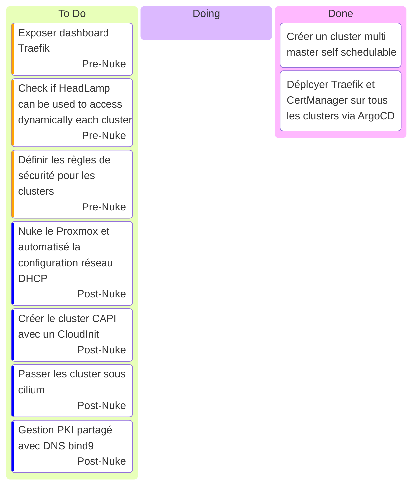

# Kanban

## Stream 15 mars 2025

- Debut : 17h10
- FIN : ~19h00 ?
- Objectif :
  - Présenté le projet
  - Terminer la configuration du cluster multi master self schedulable
  - Déployer Traefik et CertManager sur tous les clusters via ArgoCD
- Bilan
  - [Headlamp injection](https://headlamp.dev/docs/latest/installation/in-cluster/#exposing-headlamp-with-an-ingress-server)
  - [Headlamp Oidc](https://headlamp.dev/docs/latest/installation/in-cluster/oidc/)
  - Task board mis a jour
