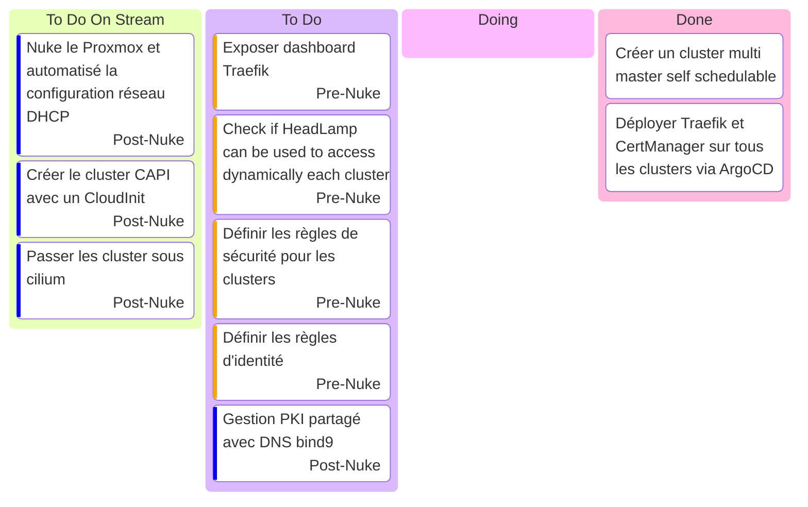

# Kanban

- [Talos Kubernetes configuration](https://www.talos.dev/v1.9/reference/configuration/v1alpha1/config/)

## Stream

### Stream 15 mars 2025

- Debut : 17h10
- FIN : ~19h00 ?
- Vod : [Twitch](https://www.twitch.tv/videos/2406435027) YouTube : Soon
- Musique: [Chillhop](https://app.chillhop.com/)
- Objectif :
  - Présenté le projet
  - Terminer la configuration du cluster multi master self schedulable
  - Déployer Traefik et CertManager sur tous les clusters via ArgoCD
- Bilan
  - [Headlamp injection](https://headlamp.dev/docs/latest/installation/in-cluster/#exposing-headlamp-with-an-ingress-server)
  - [Headlamp Oidc](https://headlamp.dev/docs/latest/installation/in-cluster/oidc/)
  - Task board mis a jour

## Music

- [Chillhop](https://app.chillhop.com/)<= Plus calme
- [NCS](https://ncs.io/) <= Plus rythmé et varié (Pas encore testé)
