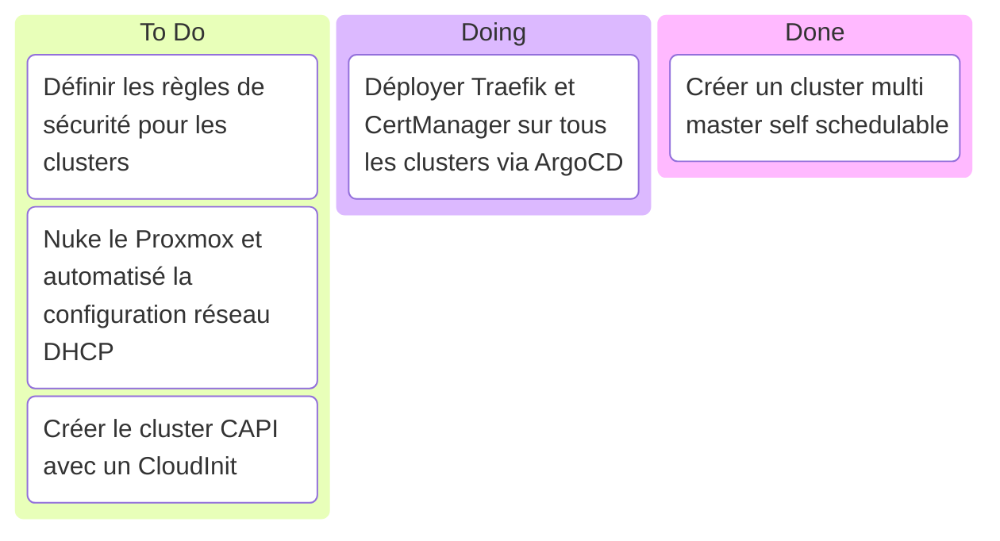

# Kanban

## Stream 15 mars 2025

- Debut : 17h10
- FIN : ~19h00 ?
- Objectif :
  - Présenté le projet
  - Terminer la configuration du cluster multi master self schedulable
  - Déployer Traefik et CertManager sur tous les clusters via ArgoCD
  - Définir les règles de sécurité pour les clusters
